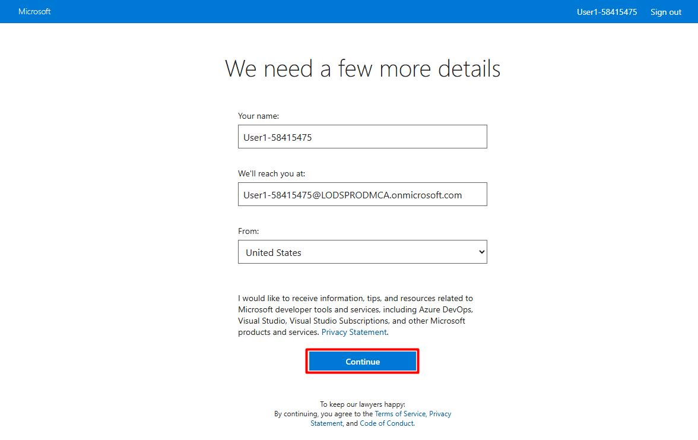
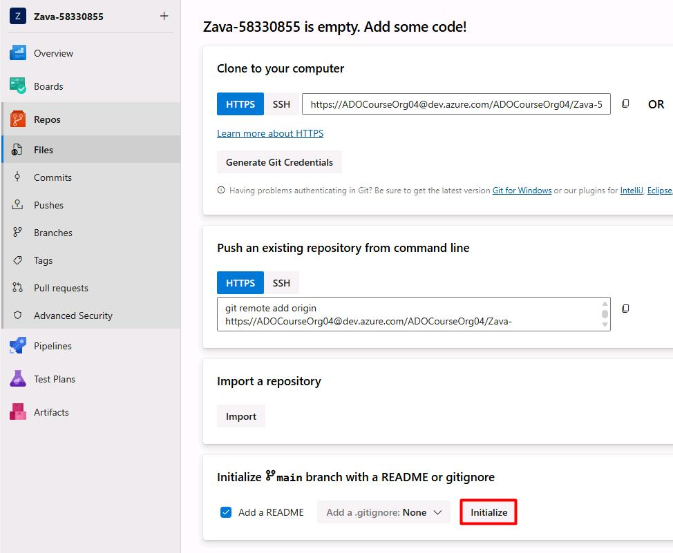

## Task 01: Initialize Azure DevOps repository branch

1. Open Microsoft Edge, then go to:

    ```
    https://aex.dev.azure.com/me
    ```

1. Sign in with your lab credentials.


1. Select **Continue**.

    

1. Under **Projects**, select **Zava-@lab.LabInstance.Id**.

    

    {: .note }
    > Your project name will differ from the screenshot.

1. Close the other **My Information** tab.

1. In the leftmost pane, select **Repos**.

1. Under **Initialize main branch with a README or gitignore**, select **Initialize**.

    