## Task 02: Prepare the environments and solution

### Key tasks

#### 01: Create Power Platform environments

1. In a new tab, go to [Power Platform admin center](admin.powerplatform.microsoft.com) .  

    {: .note }
    > This will open the Power Platform admin center.
  
1. In the leftmost pane, select **Manage**.

    {: .note }
    > You'll create three environments.

1. Wait until the environments list loading error goes away.

    {: .warning }
    > This may take 15-20 minutes following the launch of the lab to finish provisioning your account in Power Platform.
    >
    > 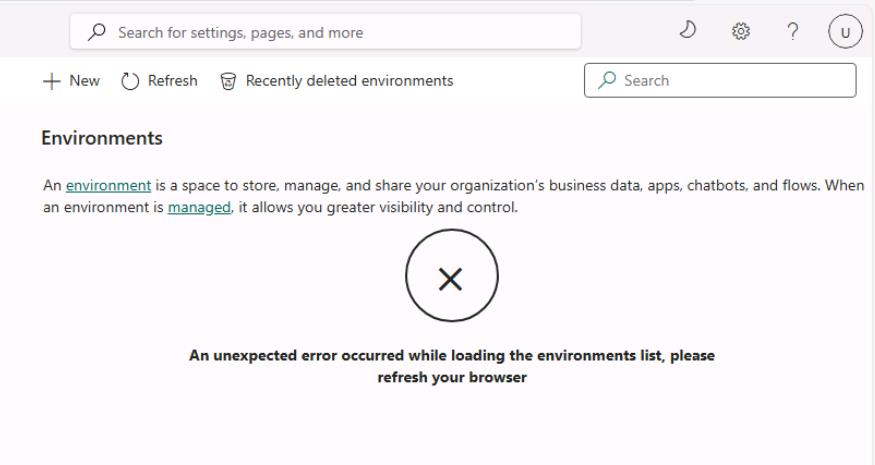
    >
    > Periodically refresh the page.

1. On the top bar of the **Environments** page, select **New**.
  
    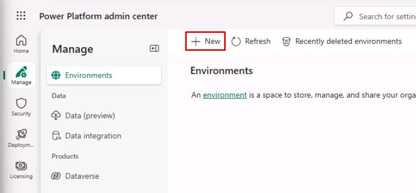

1. In the flyout pane:

    1. Enter the following details: 

        | Item     | Value               |
        |----------|---------------------|
        | Name | `Zava Retail - Dev`  |
        | Region | **United States** |
        | Type | **Developer** |

        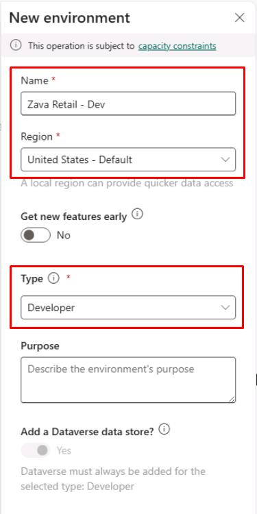
    
    1. At the bottom of the flyout pane, select **Next**.

    1. Keep the defaults, then select **Save**.  

        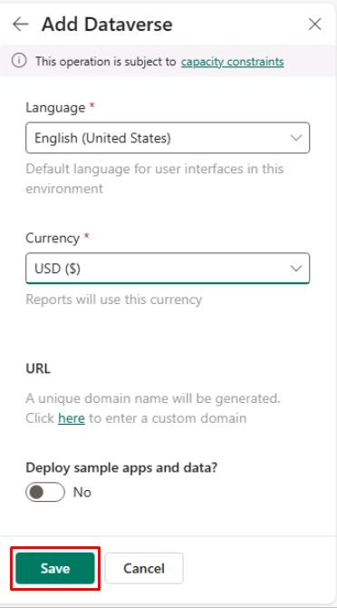

1. On the top bar, select **New** again.

1. In the flyout pane:

    1. Enter the following details: 

        | Item     | Value               |
        |----------|---------------------|
        | Name | `Zava Retail - UAT`  |
        | Region | **United States** |
        | Type | **Developer** |
    
    1. Select **Next**.

    1. Select **Save**.  

    {: .important }
    > You could also use **Sandbox** instead of **Developer** in a real-world environment.

1. On the top bar, select **New** again.

1. In the flyout pane:

    1. Enter the following details: 

        | Item     | Value               |
        |----------|---------------------|
        | Name | `Zava Retail - Prod`  |
        | Region | **United States** |
        | Type | **Developer** |
    
    1. Select **Next**.

    1. Select **Save**.  

    {: .important }
    > Use **Production** instead of **Developer** in a real-world environment.

    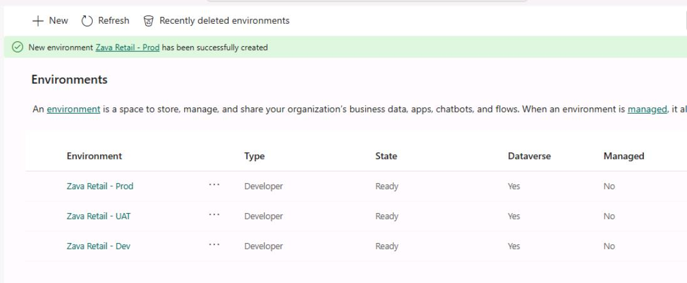

1. Select **Zava Retail - Dev**.

    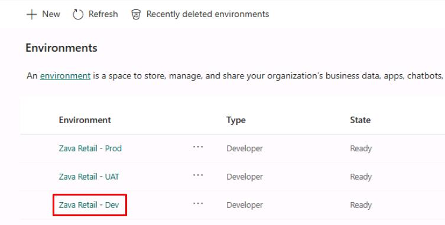

1. Under **Environment ID**, copy and paste the value into a notepad for later use.

    {: .warning }
    > Delete any leading or trailing spaces from the text box.

    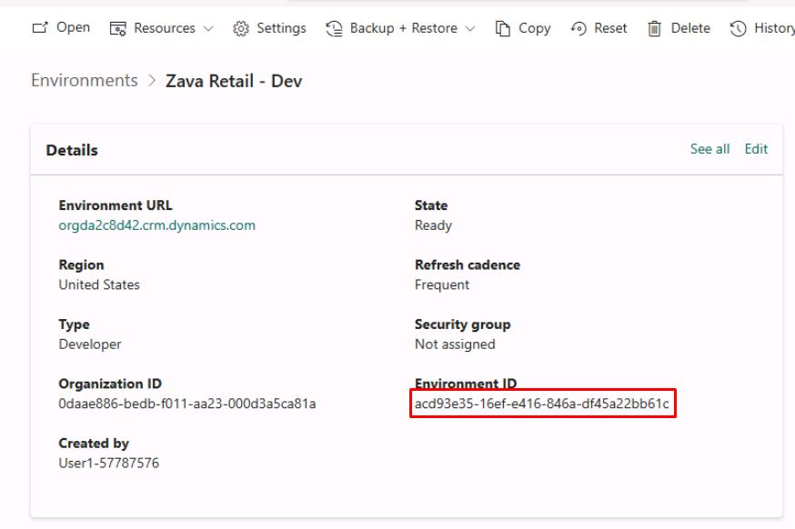

1. Go back to the **Environments** page, then paste the **Environment ID** of the other two environments in the notepad.

    | Item | Value |
    |---|---|
    | UAT | @lab.TextBox(uat) |
    | Prod | @lab.TextBox(prod) |

    {: .warning }
    > These values will be used for reference in future instructions and must be filled in.   
    >
    > Delete any leading or trailing spaces from the text box.

---

#### 02: Set environments as Managed

1. On the VM's taskbar, open Windows PowerShell ISE.

1. In PowerShell ISE, select **File** > **New**.

1. In the top pane, enter the following:

    {: .important }
    > Select **Copy** in the following block, then paste with **Ctrl+V**.

    ```
    # Environment IDs - Uses the values you pasted in the text boxes.
    $dev  = '@lab.Variable(dev)'
    $uat  = '@lab.Variable(uat)'
    $prod = '@lab.Variable(prod)'

    $environmentIds = @($dev, $uat, $prod)

    $GovernanceConfiguration = [pscustomobject]@{
        protectionLevel = "Standard"
        settings = [pscustomobject]@{
            extendedSettings = @{}
        }
    }

    foreach ($envId in $environmentIds) {
        # Skip placeholders (optional safety)
        if ([string]::IsNullOrWhiteSpace($envId) -or $envId -eq "placeholder") {
            Write-Host "Skipping envId='$envId' (placeholder/empty)" -ForegroundColor Yellow
            continue
        }

        Write-Host "Applying governance config to environment: $envId" -ForegroundColor Cyan

        Set-AdminPowerAppEnvironmentGovernanceConfiguration `
            -EnvironmentName $envId `
            -UpdatedGovernanceConfiguration $GovernanceConfiguration
    }
    ```

    {: .warning }
    > **$dev**, **$uat**, and **$prod** use the values entered in the prior text boxes.

1. On the top bar, select **Run Script** ().

    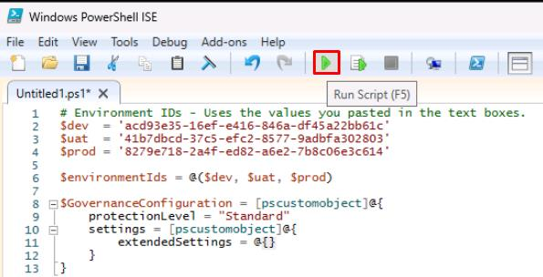

1. In the dialog, sign in with your lab credentials.

1. The output in the bottom pane should show **Code: 202** and **Accepted** for all three environments.

    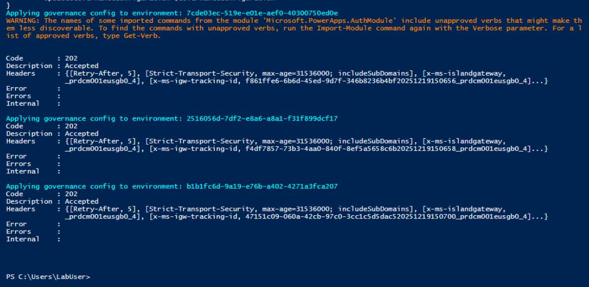

1. Go back to your tab for the Power Platform admin center.

1. Under the **Manage** menu, select **Environments**.

    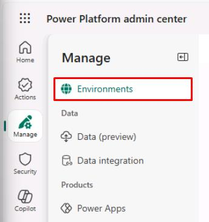

1. Refresh the page.

1. The **Managed** column should show **Yes** for all three environments.

    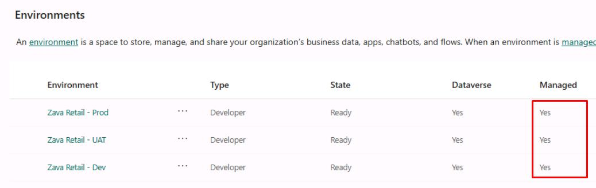

1. Close PowerShell ISE without saving.

---
  
#### 03: Change environments

1. In a new browser tab, go to the [PowerApps homepage](make.powerapps.com).

1. In the dialog, select **Get started**.

1. Near the upper-right corner of the page, select **Environment**, then select **Zava Retail - Dev**.

    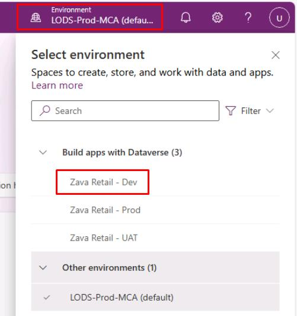

    

    {: .warning }
    > Depending on screen resolution, you may need to select the globe icon to open the **Select environment** pane.
    >
    > 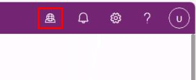

---

#### 04: Import the retail service solution

1. In the leftmost pane of Power Apps, select **Solutions**. 

1. On the top bar, select **Import solution**.

    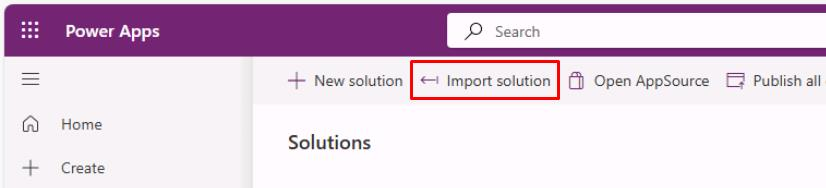

1. In the flyout pane, select **Browse**.

1. In the **Open** window, in `C:\LabFiles`, select **ZavaGlobalServiceDesk_@lab.LabInstance.Id_1_0_0_0**, then select **Open**.

    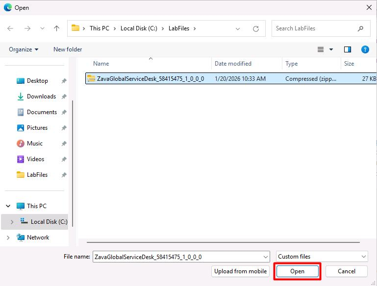

1. At the bottom of the flyout pane, select **Next**.

1. Select **Import**.

1. Wait until the top banner shows the solution imported successfully.

    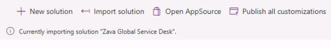

    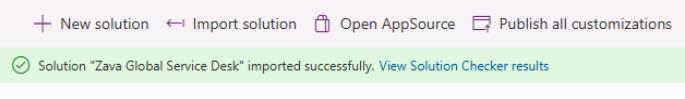

    {: .warning }
    > This may take 5-10 minutes.
    >
    > If waiting longer than 10 minutes, refresh the page.
    > If you see an error like the following, try importing again:
    > - *Solution "Zava Global Service Desk" failed to import: Cannot start another [Import] because there is a previous [Import] running at this moment...*

---

#### 05: Import data into the tables

1. Select the new **Zava Global Service Desk** solution.

    {: .note }
    > There are four tables included in the solution, which you'll import sample data to.
    >
    > 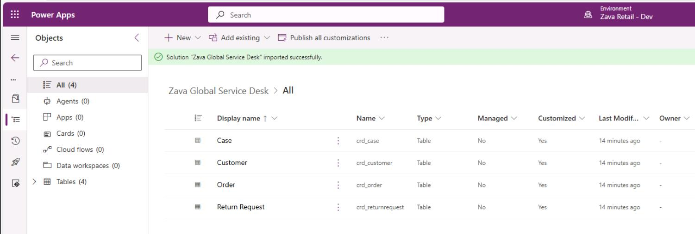

1. Select **Customer**.

    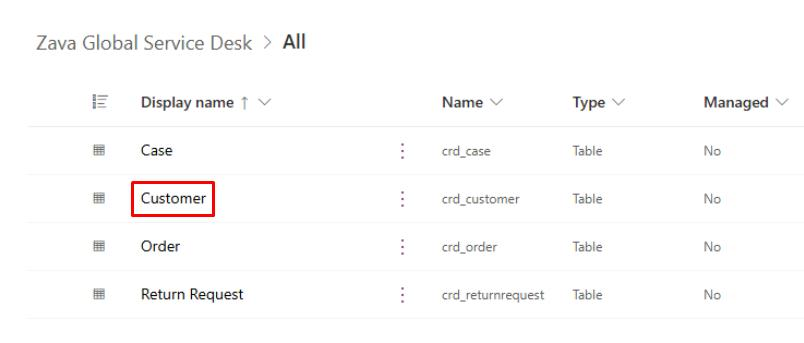

1. On the top bar, select **Import** > **Import data from Excel**.

    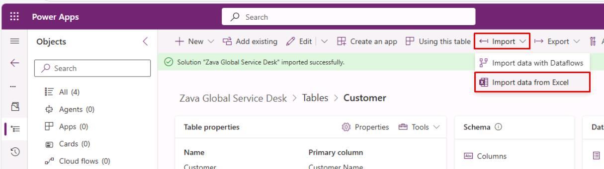

    {: .warning }
    > If you see the following error, close the flyout pane, refresh the page, then try again.
    >
    > 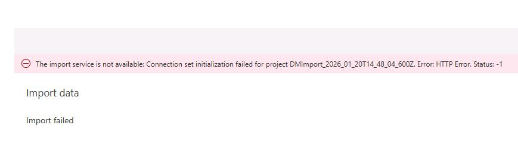

1. In the flyout pane:

    1. Select **Upload**.

    1. In `C:\LabFiles`, select **crd_customers**, then select **Open**.

    1. Wait until **Mapping status** shows **Mapping was successful**.

        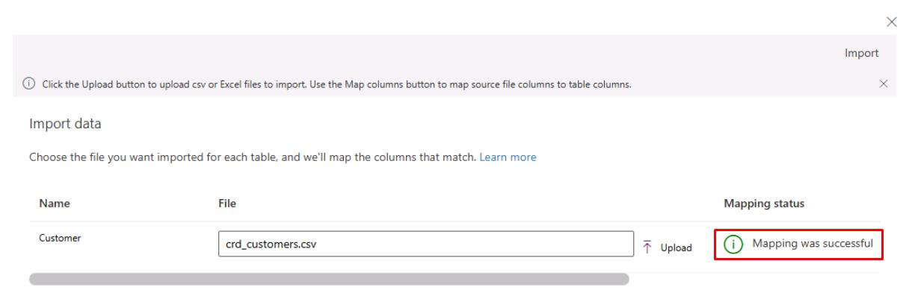

    1. In the upper-right corner of the flyout pane, select **Import**.

        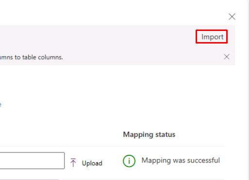

        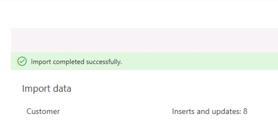

        {: .warning }
        > If you see **Import failed** with **Status: -1**, refresh the page to see if the data imported successfully, as it's likely a transient error.
        >
        > 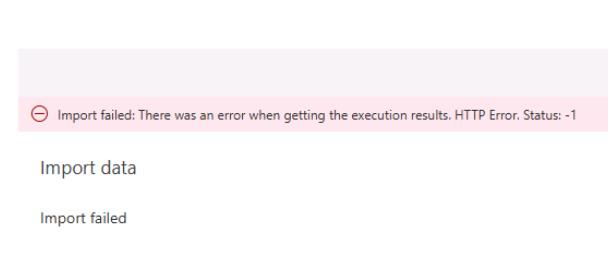

    1. Once imported, close the flyout pane.

1. Refresh the page to see the imported data.

    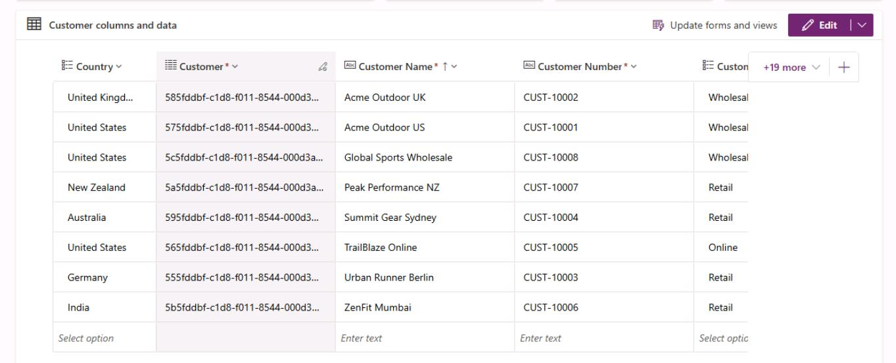

1. Below the page's top bar, select the **Tables** breadcrumb link.

    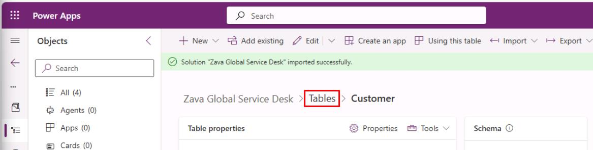

1. Repeat the same upload steps for the following tables, in this order:

    1. **Order** - Using **crd_orders**.

        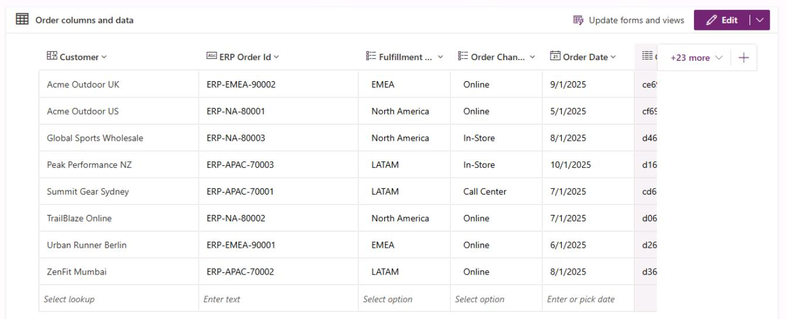

    1. **Case** - Using **crd_cases**.

        {: .note }
        > **Mapping warnings exist** can be ignored.
        >
        > 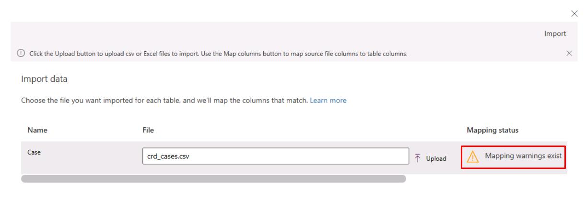
        >
        > 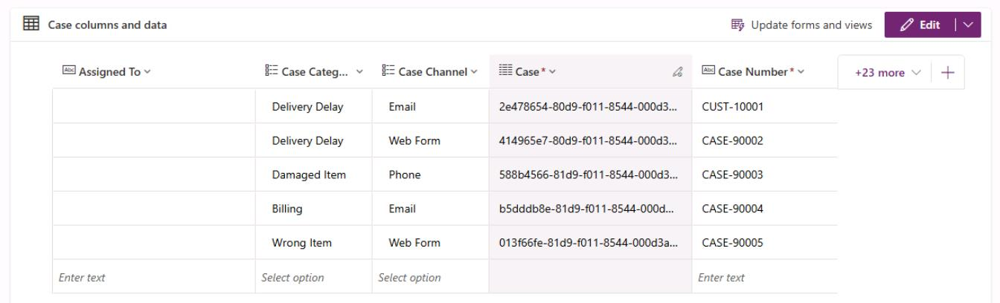

    1. **Return Request** - Using **crd_returnrequests**.

        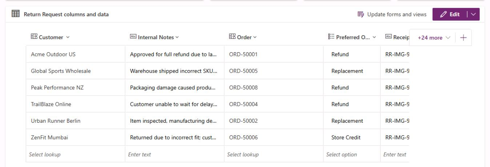

    {: .warning }
    > If you see **Import failed** with **Status: -1**, refresh the page to see if the table data imported successfully, as it's likely a transient error.
    >
    > 

1. Confirm you see the imported data in the tables.
