## Task 03: Create a modern order processing solution using Plan Designer

1. In the leftmost pane, select the **<-** icon to go **Back to solutions**.

    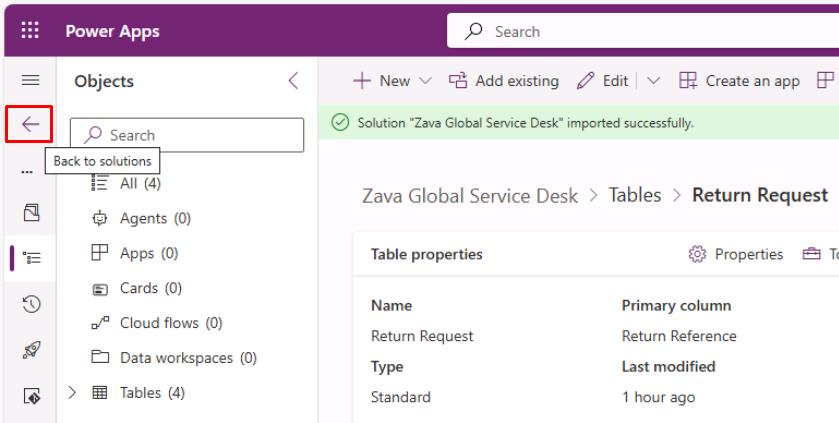

1. In the leftmost pane, select **Plans**.

1. On the top bar, select **New plan**.  
  
1. In the dialog, enter the following business problem:  

    ```
    Modernize global customer order processing by replacing email/Excel trackers with a structured Dataverse-backed solution. Agents can search customers and orders, log cases, and trigger follow-ups integrated with ERP and CRM.
    ```

    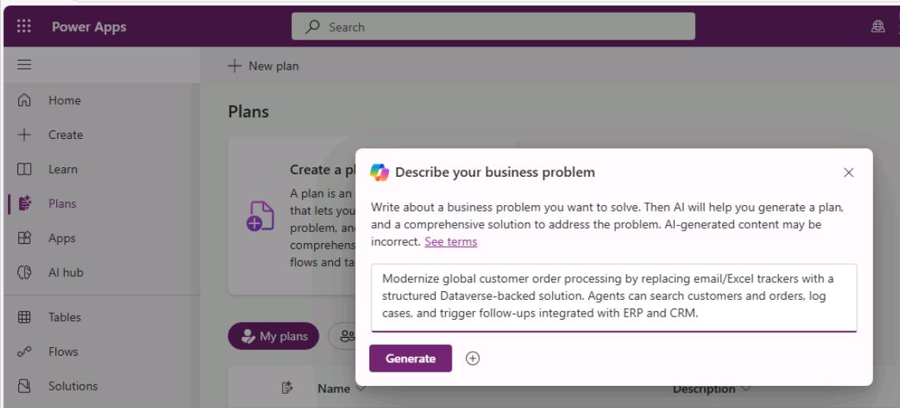
  
1. Select **Generate**.  

1. In the plan designer's left pane, it will generate a plan for the **User requirements**. 

1. At the bottom of the pane, in response to the generated **User requirements** section, select **Edit**.

    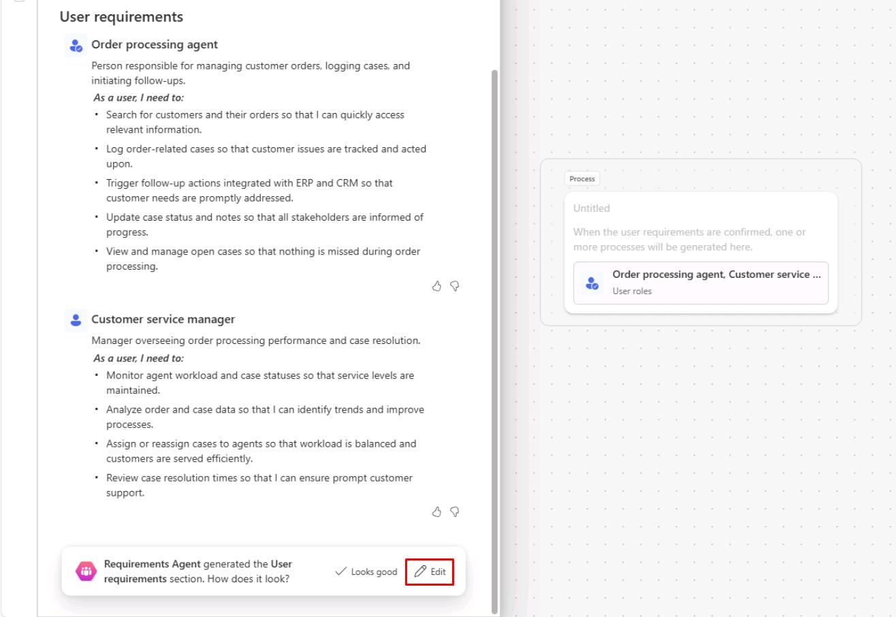

    {: .note }
    > Your generated data will differ from the image.

1. In the upper-right corner of the **User requirements** section, select the **+** to **Add user role**.

    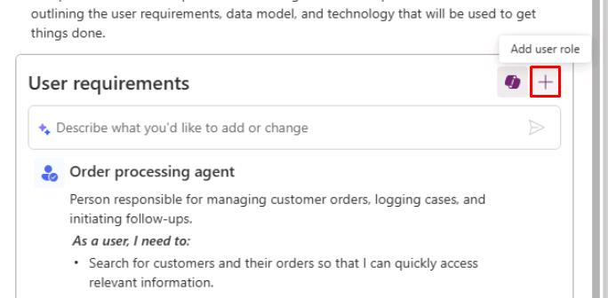

    {: .note }
    > The new role entry will appear at the bottom of the pane.

1. In the **Type user role here** box, enter:

    ```
    Global Customer Service Desk team
    ```

    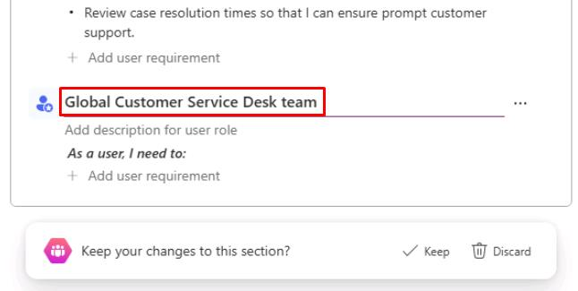

1. Delete all of the other generated roles it proposed. Hover the line over a role, select the ellipsis (**...**), then select **Delete user role**.

    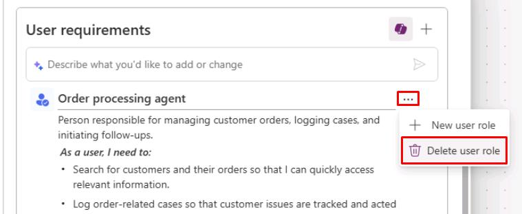

1. Under **User requirements**, in the **Describe what you'd like...** box, enter the following:

    ```
    Build a model-driven app for the Global Customer Service Desk team to: Search customers by name, country, and customer number; View and filter orders by region, status, and channel; Create and manage cases linked to a customer and an order; Track case status, priority, and resolution notes; Provide dashboards for open cases by region, priority, and category.
    ```

    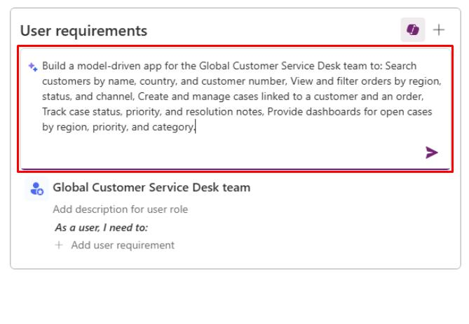

1. Select **Enter** to send the prompt.

1. At the bottom of the left pane, select **Keep**.

    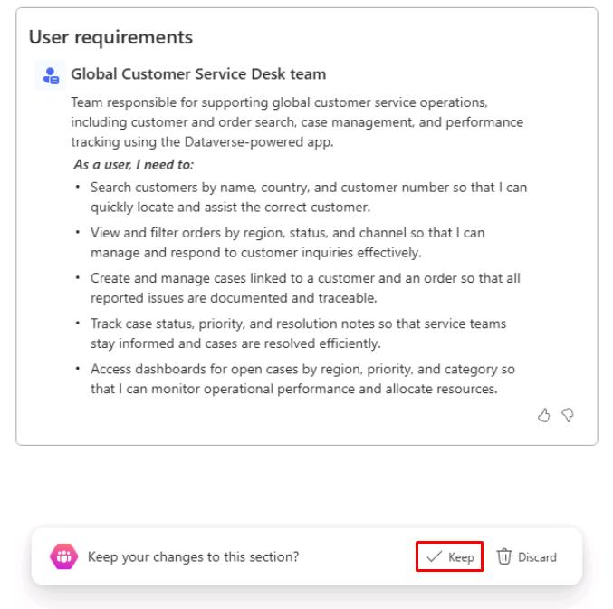

1. At the bottom of the left pane, select **Looks good**.

    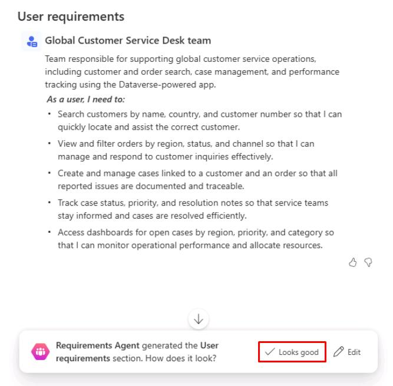

1. Select **Looks good** to the rest of the agent's plan.

1. After the **Technology** proposal, select **Save plan**.

    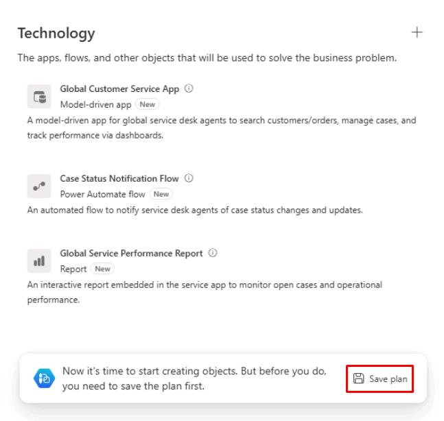

1. In the dialog:

    1. Expand **Advanced**.

    1. Select **Select an existing solution**.
    
    1. Select **Zava Global Service Desk** from the dropdown menu.

        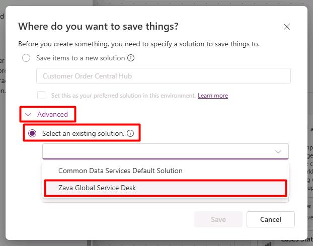

    1. Select **Save**.

1. In the left pane, under the **Technology** section, hover the **Model-driven app**, then select the **+** icon to **Create**.

    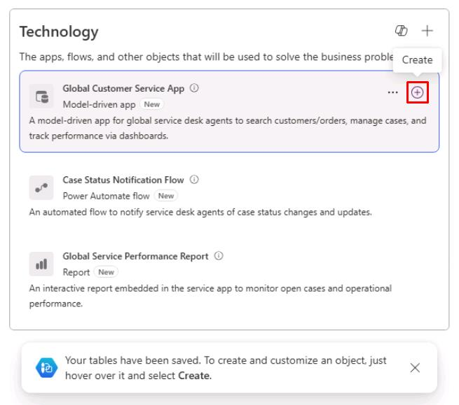

    {: .note }
    > This will open the app editor.

1. The model-driven app will show several pages it created using the data we imported. Observe the results.

    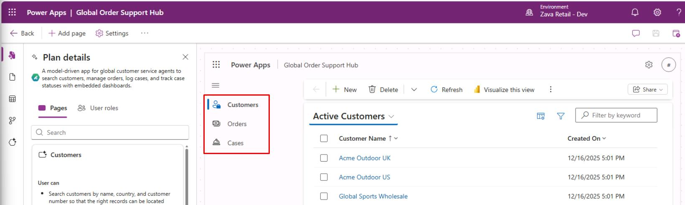

1. In the upper-right corner of the app editor, select the **Save and Publish** icon.

    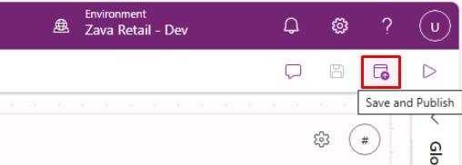

    {: .note }
    > Wait until the page refreshes.

1. After the page refreshes after saving, close the tab to return to the plan designer.

1. The **Model-driven app** will become highlighted after a minute.

    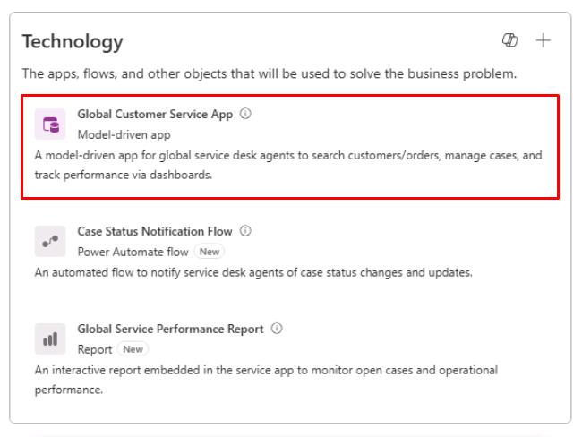

1. Delete all the other **Technology** proposals that it allows you to delete. 

    > Hover the line, select the ellipsis (**...**), then select **Remove from plan**.

    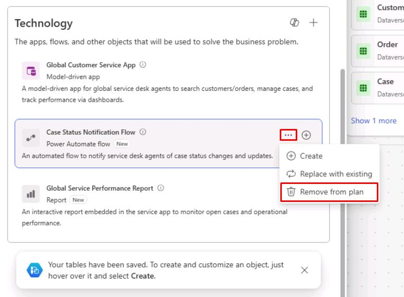

1. At the bottom of the left pane, select **Keep**.

    {: .note }
    > If you didn't need to delete anything, you won't see this option.

1. In the upper-right corner of the page, select the **Save** icon.

    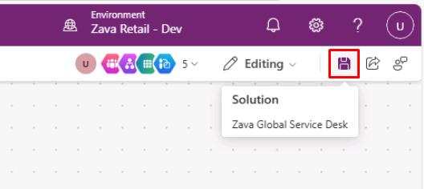

1. In the dialog, select **Save**.

    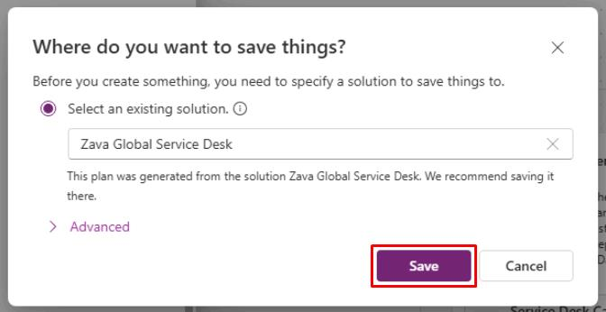

1. In the upper-left corner of the page, select **Back**.

    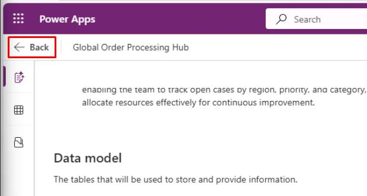
