## Task 04: Add AI-assisted productivity features


### Key tasks

#### 01: Use AI hub to auto-summarize case descriptions

1. In the leftmost pane, select **AI hub**.

1. Select the **Prompts** tile.

    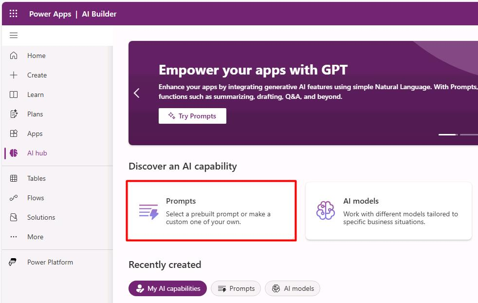

1. Select the **Summarize text** tile.

    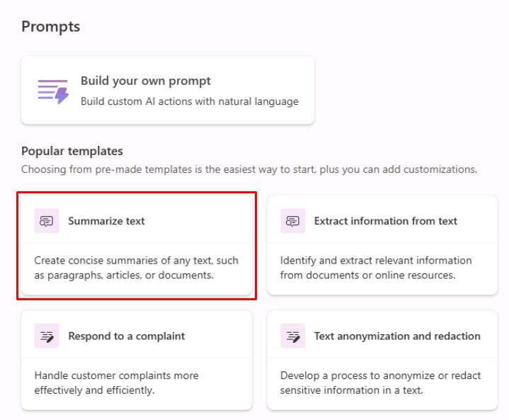

1. In the dialog:

    1. Replace the text in the top box to set the prompt name to:
    
        ```
        Case Summary Generator
        ```

    1. In the leftmost **Instructions** pane, enter the following:

        ```
        You are a customer service assistant. Summarize the following case description in 2 sentences focusing on the issue and expected outcome
        ```
        
        

    1. In the lower-right corner of the dialog, select **Save**.

    1. Once saved, close the dialog.

1. In the leftmost pane, select **Solutions**.

1. Select **Zava Global Service Desk**.

    

1. On the top bar, select **Add existing** > **AI Model**.

    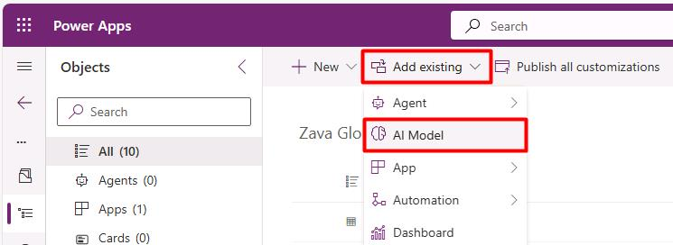

1. In the flyout pane, select the **Case Summary Generator** you created, then select **Add** at the bottom of the pane.

1. On the top bar, select **New** > **Automation** > **Cloud flow** > **Automated**.

    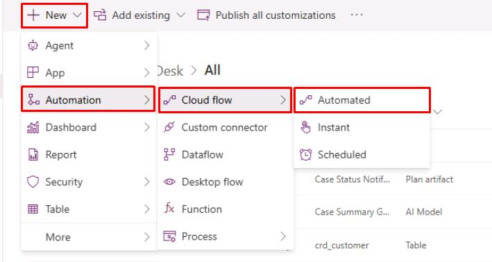

1. In the dialog:

    1. For **Flow name**, enter `Case Summary`.

    1. In the search box for **Choose your flow's trigger**, enter `Dataverse`.
    
    1. Select **When a row is added, modified, or deleted**.

        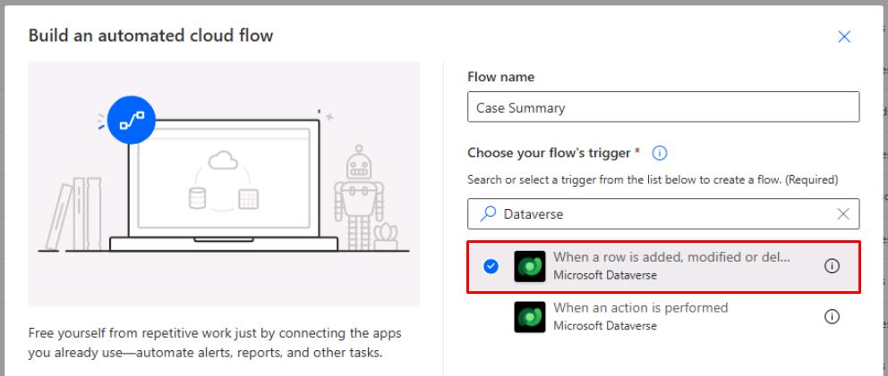

    1. Select **Create**.

        {: .note }
        > This will open the flow configuration page.

1. In the **Microsoft Dataverse** tile, select **Sign in**.

    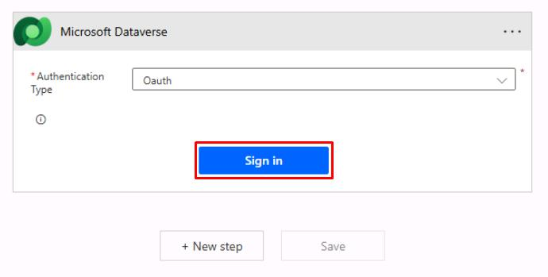

1. In the dialog, select your lab user account.

1. Enter the following details in the **Dataverse** section:

    | Item | Value |
    |---|---|
    | Change type | `Added or Modified` |
    | Table name | `Cases` |
    | Scope | `Organization` |

    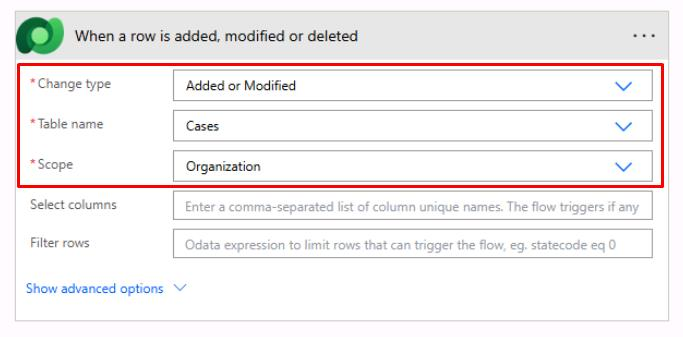

1. Below the tile, select **New step**.

1. In the search box, enter and select `Run a prompt` (AI Builder).

    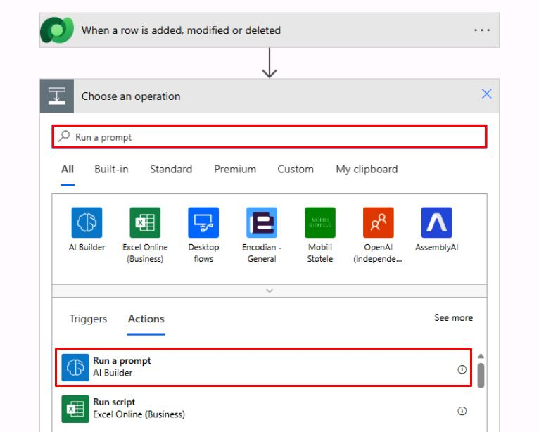

1. In the **Prompt** dropdown menu, select `Case Summary Generator`.

    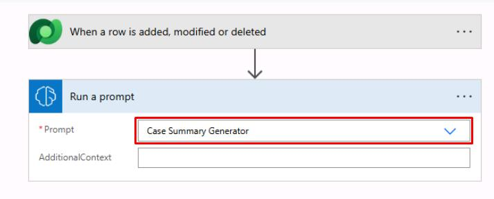

1. Below the **Run a prompt** step, select **New step**.

1. In the search box, enter `Dataverse Update a row`, then select **Update a row**. 

    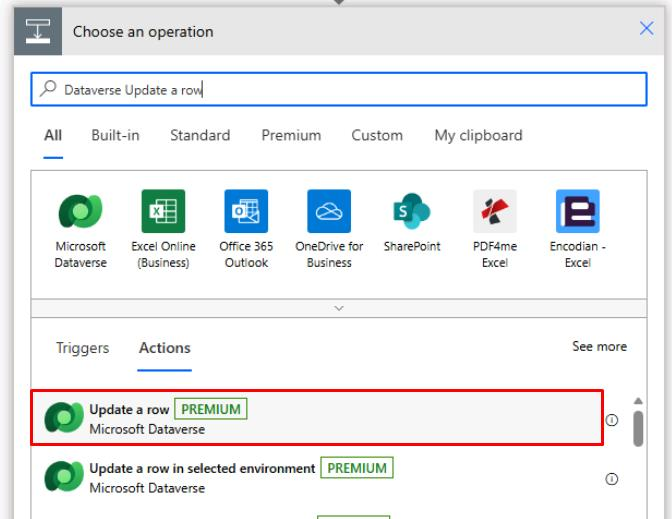

1. Enter the following details:

    1. For **Table name**, select `Cases`.

    1. Select the **Row ID** box.

    1. In the flyout pane, select **Case** (Unique identifier for entity instances).

        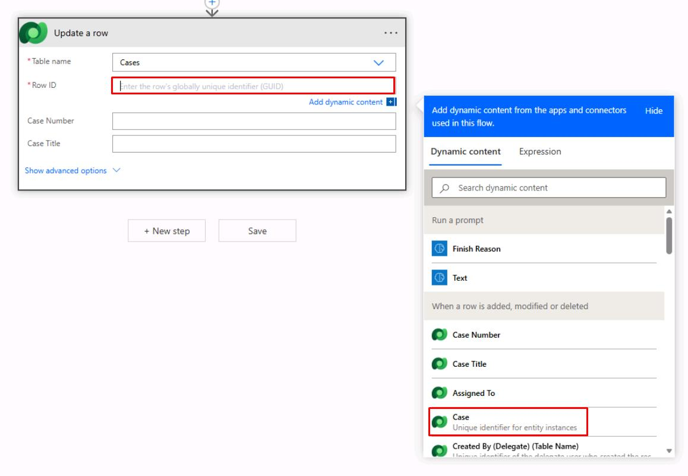

    1. Select **Show advanced options**.

        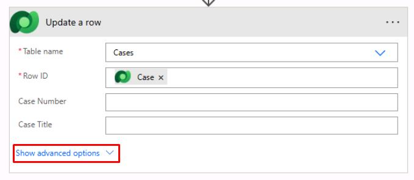

    1. Move to the bottom of the tile, then select the **Summary** box.

    1. In the flyout pane, under the **Run a prompt** section, select **Text**.

        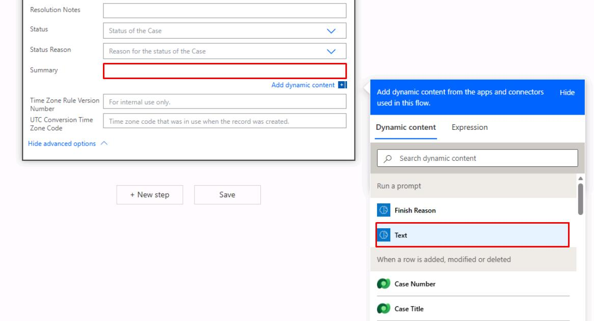

1. Near the upper-right corner of the page, select **Save**.

    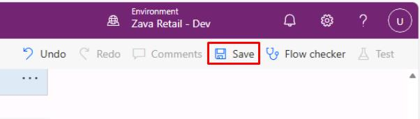

1. Once saved, in the upper-left corner of the page, select the **<-** icon.

    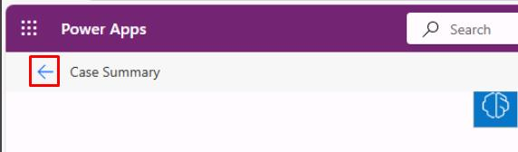

---

#### 02: Add a generative page for self-service insights

1. In your solution, select the name of your **Model-Driven App**.

    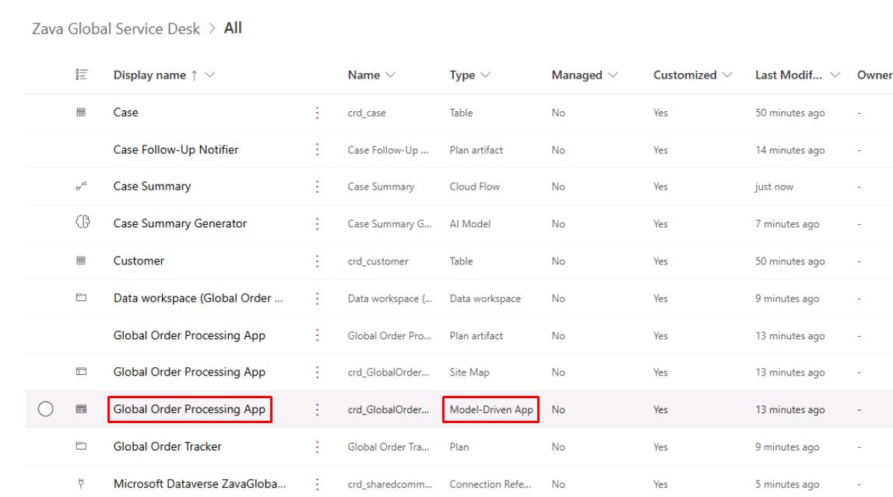

    {: .note }
    > Your generated app name will differ.

1. Near the upper-left corner of the page, select **Add page**, then select **Describe a page**.

    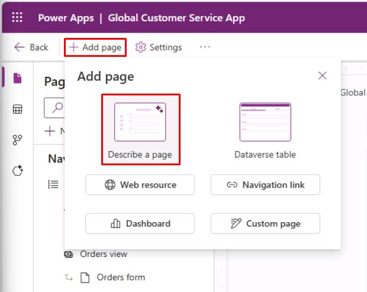
  
1. In the prompt box, enter:

    ```
    Data source: Use 'Cases' and 'Orders' tables. Allow customer service leads to ask natural language questions like: "Show me high-priority cases in APAC created this week", or "Which customers have more than three open cases?"
    ```

1. Select **Enter** to send.

1. Once the page is generated, test by entering a prompt in the page:  
  
    ```
    List open high priority cases by region.
    ```  

    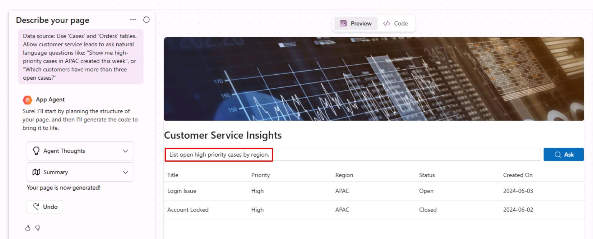

    {: .note }
    > Your page will look different but should provide the option to prompt.

    {: .warning }
    > If you see no results or option to prompt, proceed to the next steps.
    >
    > While you can prompt further in the left pane's page description, don't spend too much time on this task. 
  
1. Near the upper-right corner of the page, select the **Save and Publish** icon.

    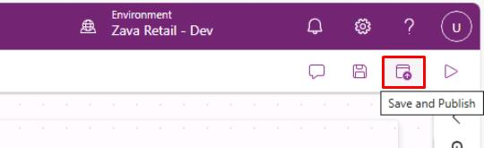

1. Once saved after the page refreshes, in the upper-left corner of the page, select **Back**.

    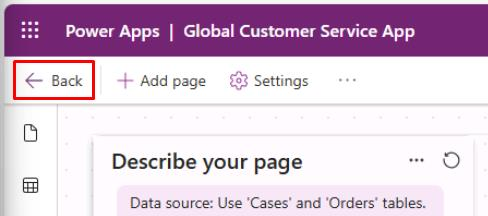

---

#### 03: Configure an agent for case triage

1. On the top bar of the solution, select **New** > **Agent** > **Agent**.

    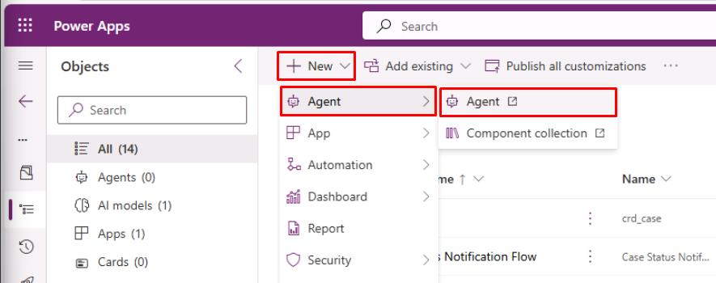

    {: .note }
    > This will open Copilot Studio.

1. In the dialog, select **Get Started**, then select **Skip**.

1. At the top of the left pane, select the **Configure** tab:

    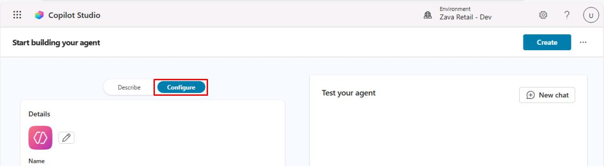
  
1. Enter the following details:

    | Item | Value |
    |---|---|
    | Name | `Zava Case Triage Agent`  |
    | Description | `Helps customer service agents triage and update cases by summarizing issues, suggesting priorities, and drafting responses.` |

1. In the **Instructions** section, enter the following:

    {: .important }
    > Select **Copy** in the following block, then paste with **Ctrl+V**.

    ```
    You are a customer service triage assistant for a global retailer. When agents ask about a case, identify the customer, related order, and suggest:
    - Likely priority
    - Recommended next action (refund, replacement, escalate to billing)

    Example user prompts:
    - Summarize case CASE-90003 and suggest an appropriate priority.
    - List all open high-priority cases for customers in APAC. 
    ```

    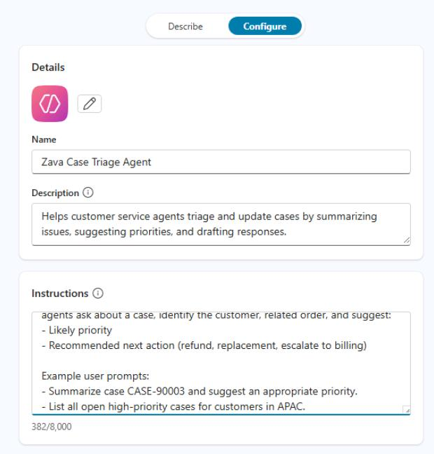

1. In the upper-right corner of the page, select **Create**.

    {: .note }
    > This will create the agent and take you directly to its page in Copilot Studio.

1. On the top bar, select the **Knowledge** tab.

    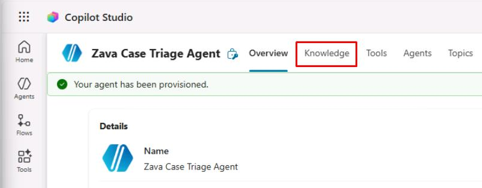

1. Select **Add knowledge**.

1. In the dialog:

    1. Select **Dataverse**.

        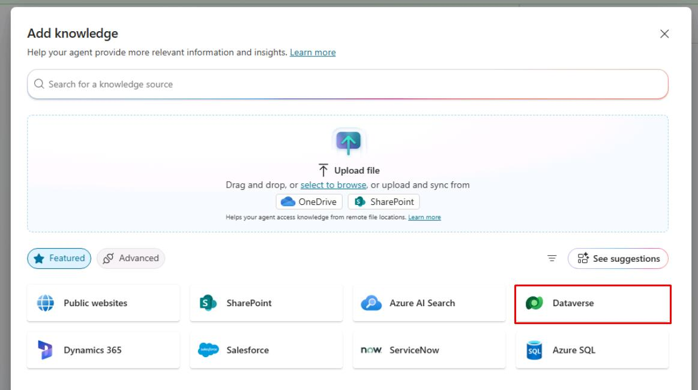

    1. Search for and select the following tables:

        - [] `Case`
        - [] `Customer`
        - [] `Order`

    1. In the lower-right corner of the dialog, select **Add to agent**.

        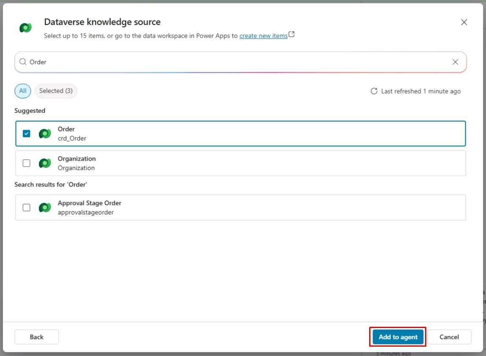
  
1. Near the upper-right corner of the page, select **Publish**.  

    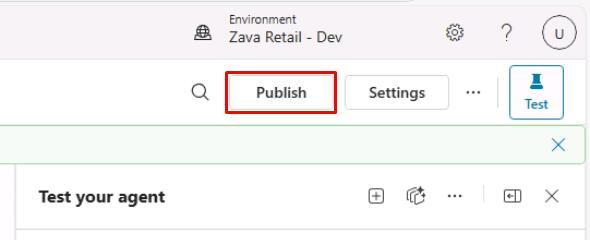

1. In the dialog, select **Publish**.

    {: .note }
    > You don't need to wait for this to finish. Proceed to the next task.

1. Close the Copilot Studio tab.
