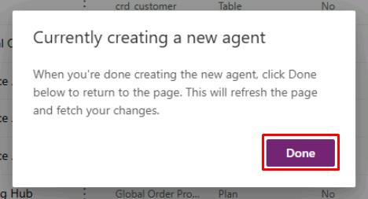
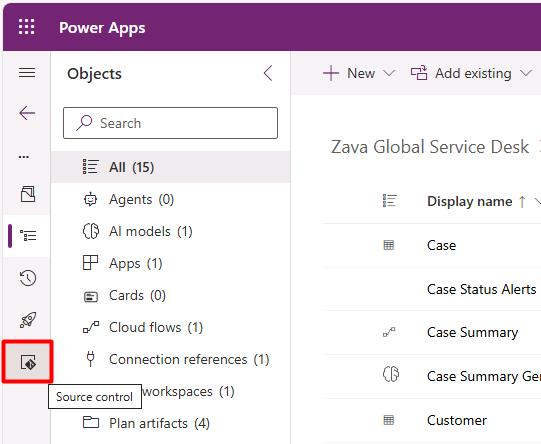
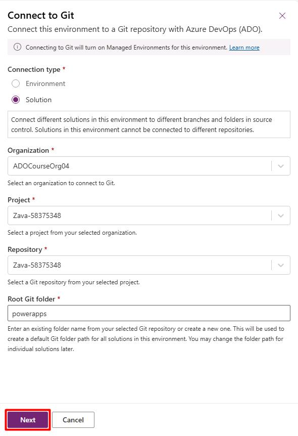
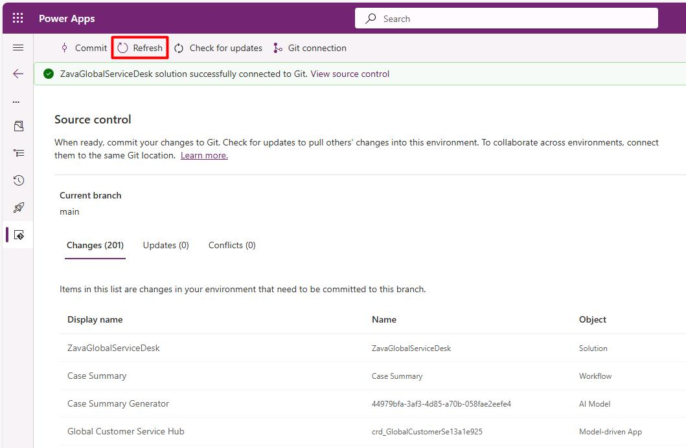
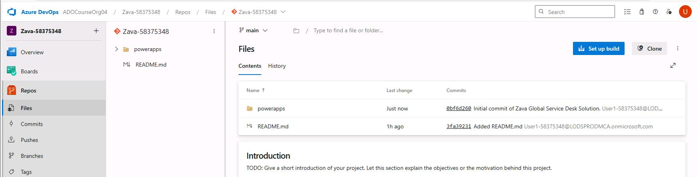
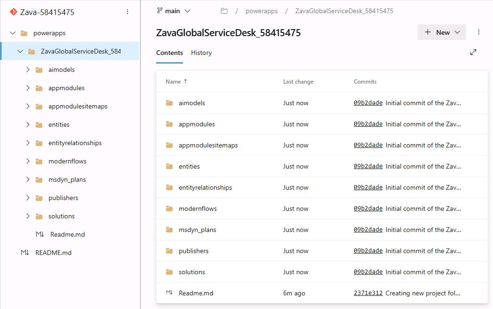

## Task 05: 

1. Go back to Power Apps tab to the **Zava Global Service Desk** solution.

1. In the dialog, select **Done**.

    

1. In the leftmost pane, select the **Source control** () icon.

    

1. Select **Connect**.

1. In the flyout pane:

    1. Enter the following information:

        | Item     | Value   |
        |:---------|:---------|
        | Connection type | **Solution**   |
        | Organization | Select organization |
        | Project | **Zava-@lab.LabInstance.Id** |
        | Repository | **Zava-@lab.LabInstance.Id** |
        | Root Git folder | `powerapps` |

    1. At the bottom of the pane, select **Next**.

        

    1. Under the **Branch** dropdown menu, select **main**. 

    1. At the bottom of the pane, select **Connect**.

    {: .note }
    > All source control components will be processed in the background. Commit functionality will be disabled until this finishes.

1. Periodically select **Refresh** on the top bar until the **Commit** button becomes available. 

    

    {: .warning }
    > This may take a few minutes.

1. On the top bar, select **Commit**.

1. In the flyout pane:

    1. Under **Comment**, enter 
    
    ```
    Initial commit of the Zava Global Service Desk Solution.
    ```

    1. At the bottom of the pane, select **Commit**.

    {: .warning }
    > This may take a few minutes.

1. Go back to your tab for Azure DevOps, then refresh the page to observe the new **powerapps** folder containing your solution.

    

    
