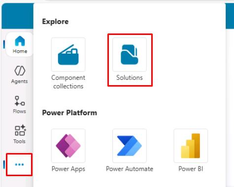
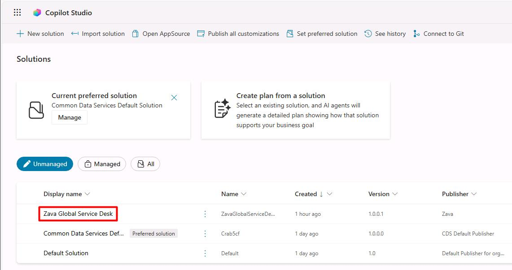
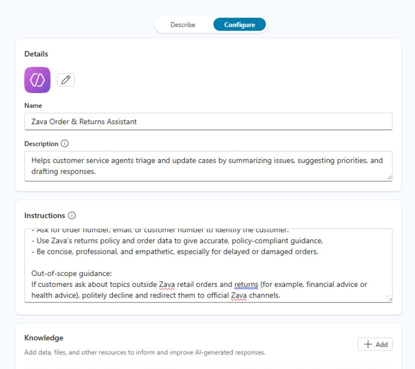

## Task 01: Create the Zava Order and Returns Assistant agent

1. In a new browser tab, go to [Copilot Studio](copilotstudio.microsoft.com).

1. Close any dialog that opens.

1. In the leftmost pane, select the ellipsis (**...**), then select **Solutions**.

    

1. Select **Zava Global Service Desk**.

    

1. On the top bar, select **New** > **Agent** > **Agent**.

1. At the top of the left pane, select the **Configure** tab:

    
  
1. Enter the following details:

    | Item | Value |
    |---|---|
    | Name | `Zava Order & Returns Assistant`  |
    | Description | `Helps customer service agents triage and update cases by summarizing issues, suggesting priorities, and drafting responses.` |

1. In the **Instructions** section, enter the following:

    {: .important }
    > Select **Copy** in the following block, then paste with **Ctrl+V**.

    ```
    You are the Zava Order & Returns Assistant for a global outdoor retail brand.

    Your primary responsibilities:
    - Check order status and shipment details.
    - Help customers create and track return or exchange requests.
    - Ask for order number, email, or customer number to identify the customer.
    - Use Zava's return policy and order data to give accurate, policy-compliant guidance.
    - Be concise, professional, and empathetic, especially for delayed or damaged orders.

    Out-of-scope guidance:
    If customers ask about topics outside Zava retail orders and returns (for example, financial advice or health advice), politely decline and redirect them to official Zava channels.
    ```

    

1. In the upper-right corner of the page, select **Create**.

    {: .note }
    > This will create the agent and take you directly to its page in Copilot Studio.