## Task 02: Add knowledge sources to the assistant


### Key tasks

#### 01: Connect Zava's return and exchange policy PDF as a knowledge source

1. On the top bar of the agent page, select the **Knowledge** tab.

1. Select **Add knowledge**.

1. In the dialog, select **select  to browse**.

    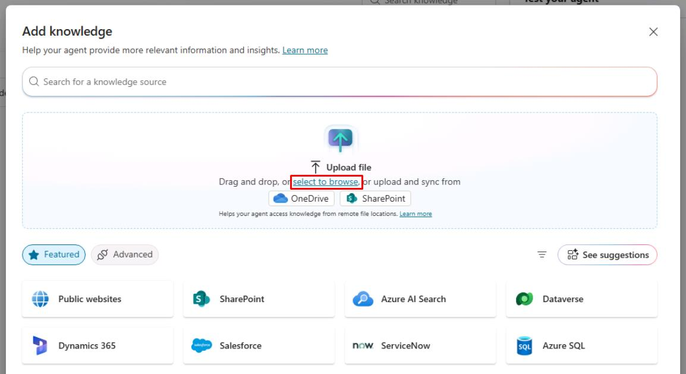

1. Go to `C:\LabFiles`, select **ZavaReturnsPolicy**, then select **Open**.

    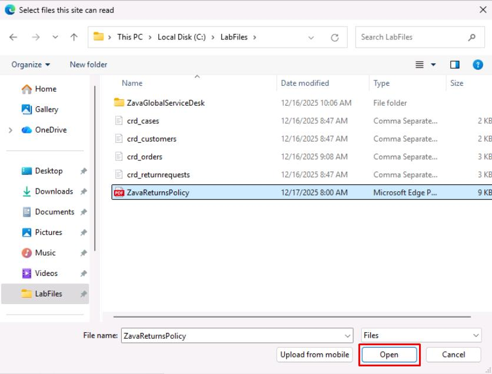

1. In the lower-right corner of the dialog, select **Add to agent**.

---

#### 02: Add Dataverse MCP server as a tool

1. On the top bar of the agent page, select the **Tools** tab.

    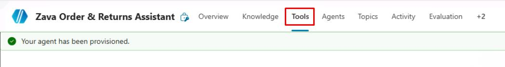

1. Select **Add a tool**.

1. In the dialog:

    1. In the search box, enter and select `Microsoft Dataverse MCP Server`.

        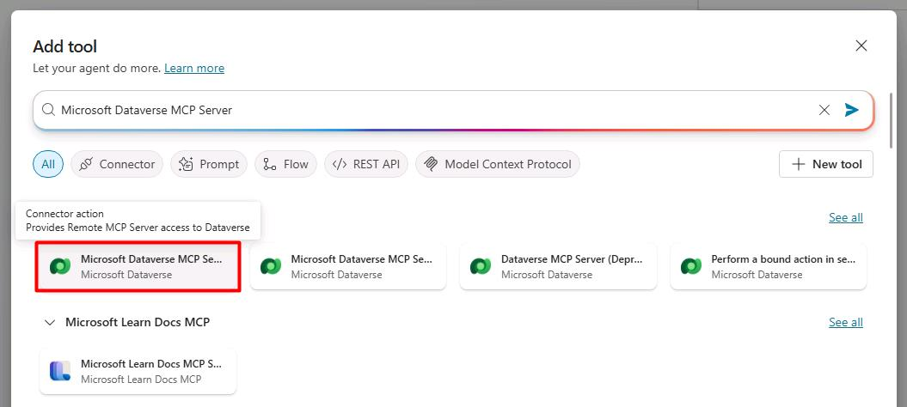

    1. In the lower-right corner of the pane, select **Add and configure**.

        {: .note }
        > This will redirect you to the tool configuration page.

        {: .important }
        > This will use your lab user account for the connection. In a real-world production environment, you should change the **Connection** to use a service account or Service Principal.

1. Update **Name** to `Get Data from Dataverse`.

    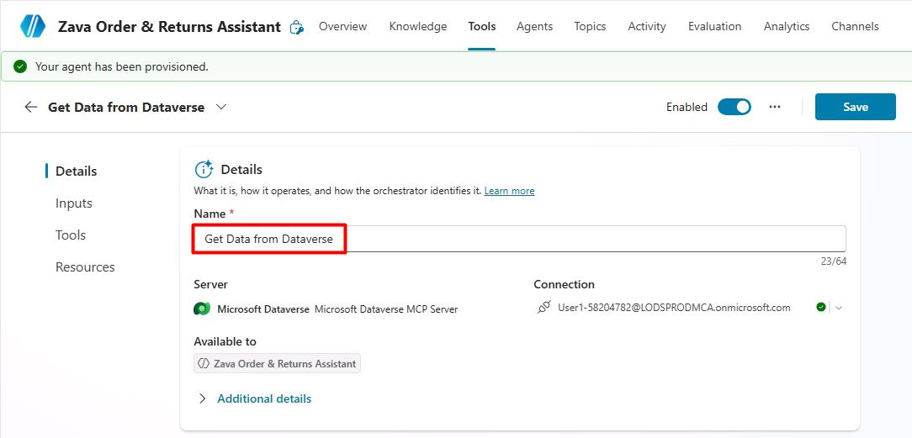

1. At the bottom of the **Details** section, expand **Additional details**.

1. Under the **Credentials to use** dropdown menu, select **Maker-provided credentials**.

    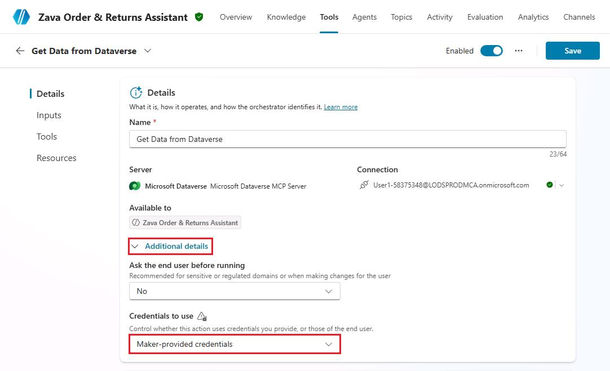

    {: .important }
    > This allows end users to access this data without authenticating through their own accounts. This will be necessary for the Power Pages site you create in a later task.

1. Observe the remaining configurations for the tool.

1. In the upper-right corner of the configuration pane, select **Save**.

    

---

#### 03: Incorporate the Dataverse MCP server and Return Policy into agent instructions

1. On the top bar of the agent page, select the **Overview** tab.

    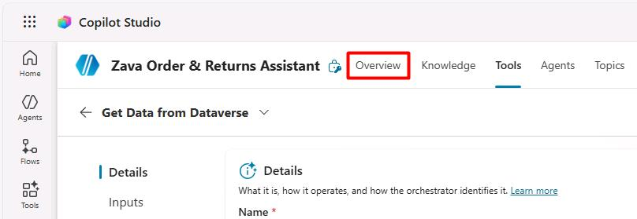

1. Move through the **Overview** page to the **Instructions** section.

    In the upper-right corner of the section, select **Edit**.

    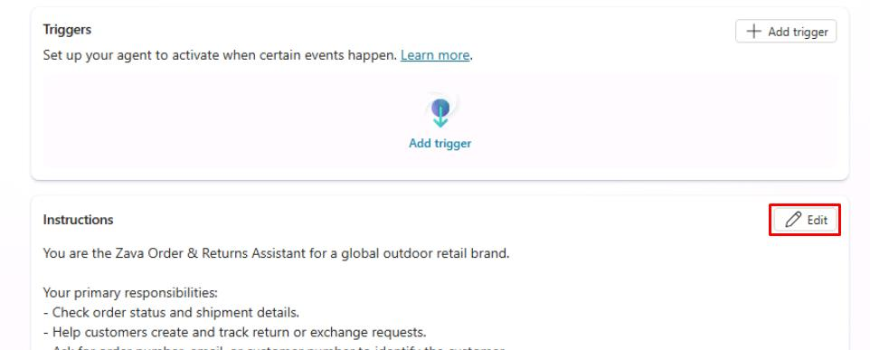

1. Add new lines in the instructions that tell the agent what to do with the new connection and knowledge source:

    {: .important }
    > Select **Copy** in the following block, then paste with **Ctrl+V**.

    ```
    When a user provides an order number, call the Microsoft Dataverse MCP server tool to fetch the exact order details using the table's 'Order Number' column to respond with a concise summary about that row. 

    Always apply Zava's returns and exchanges policy from the ZavaReturnsPolicy knowledge source before promising refunds or replacements.
    If a customer request falls outside the policy, explain the limitation and suggest contacting Zava Customer Support.

    Never ask for full payment card numbers or sensitive personal information.
    Do not override or contradict the policy even if the user insists.
    ```

1. In the upper-right corner of the **Instructions** section, select **Save**.

    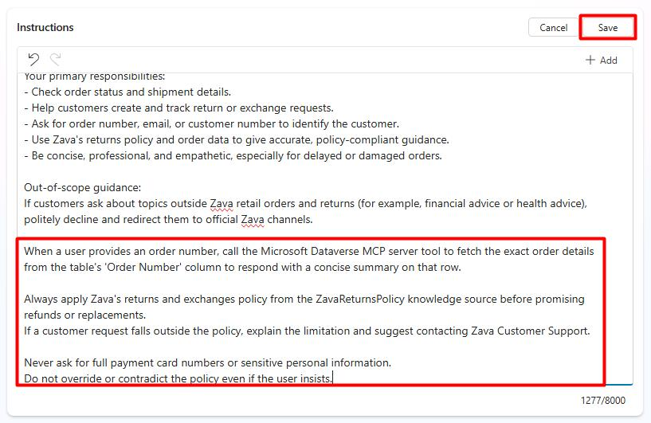


{: .important }
> To further expand in a real-world scenario, to allow customers to upload receipts you could include instructions like the following:
>
> *If the customer wants to upload a receipt, prompt them to upload the file using the chat upload capability. Once uploaded, acknowledge receipt, summarize the file name, and indicate that the request will be reviewed according to policy.*
>
> You could then create a flow that ingests the file to provide a response to the user.

---

#### 04: Test the agent

{: .important }
> You can open and close the test pane, as needed, by selecting **Test** in the upper-right corner of the page.
>
> 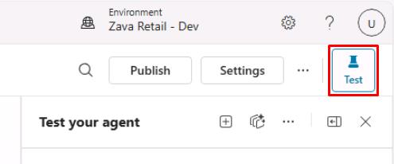

1. In the rightmost **Test your agent** pane:

    1. At the top of the pane, select the **+** icon to start a new chat.

        

    1. Enter the following prompt to test the instructions:

        ```
        Could I get a status update for order ORD-50001?
        ```

        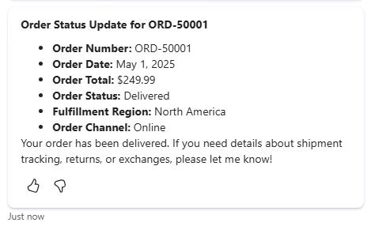

        {: .note }
        > The agent will invoke the Dataverse MCP server tool to generate its response. The left pane shows what it's doing in the background.
