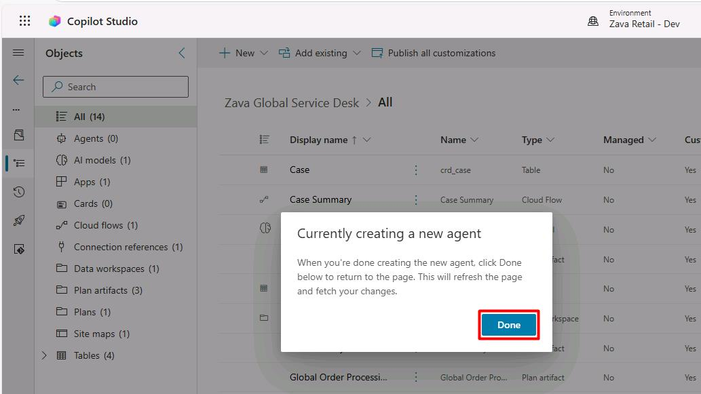
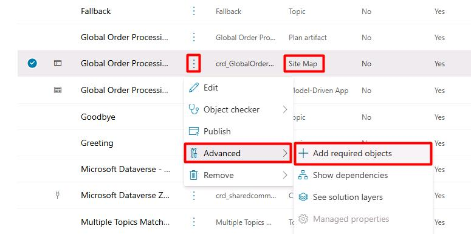
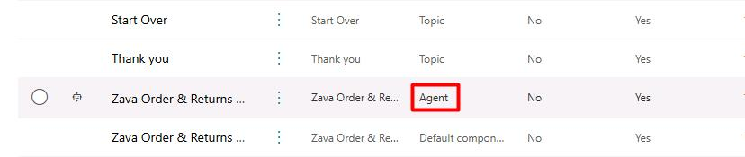
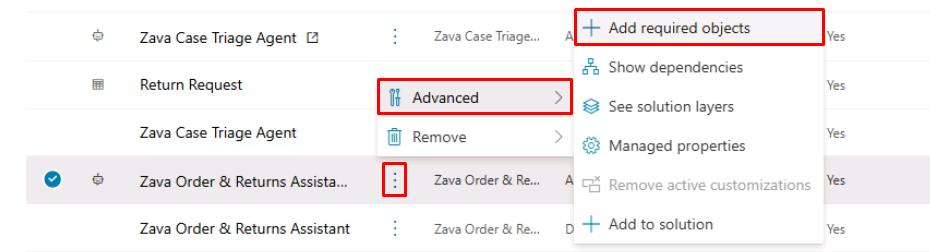
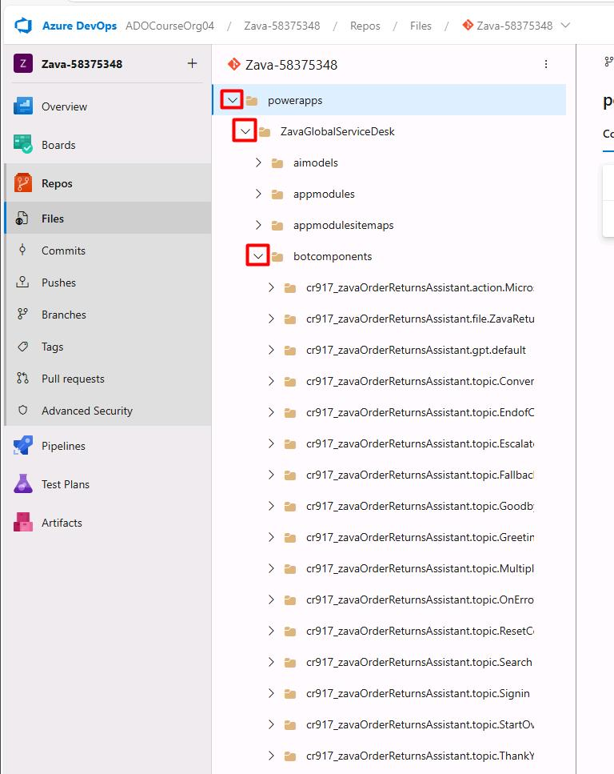
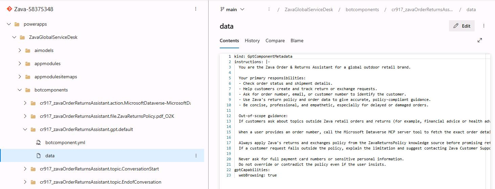

## Task 03: Add required components to the agent in the solution

1. Go back to your other Copilot Studio **Solutions** tab with **Zava Global Service Desk** open.

1. In the dialog, select **Done**.

    

1. Under the third **Type** column, find the entry for **Site Map**:

    1. Select the vertical ellipsis > **Advanced** > **Add required objects**.

        

        {: .note }
        > The name of your app's site map will differ.

    1. In the flyout pane, select **OK**.

1. On the line for the **Zava Order & Returns Assistant** (Type: **Agent**):

    

    1. Select the vertical ellipsis > **Advanced** > **Add required objects**.

        

    1. In the flyout pane, select **OK**.

1. In the leftmost pane, select the **Source control** () icon.

    

1. On the top bar, select **Commit**.

1. In the flyout pane:

    1. Under **Comment**, enter 
    
        ```
        Added Copilot Studio agent with Policy Knowledge and Dataverse MCP Server.
        ```

    1. At the bottom of the pane, select **Commit**.

1. Once committed, go back to your tab for the Azure DevOps repo.

1. In the leftmost pane, under **Repos**, select **Files**.

1. In the navigation pane of the repo, expand **powerapps** > **ZavaGlobalServiceDesk_@lab.LabInstance.Id** > **botcomponents** to observe your new agent's components.

    

1. Expand **cr[XYZ]_zavaOrderReturnsAssistant.gpt.default**, then select **data**.

    
