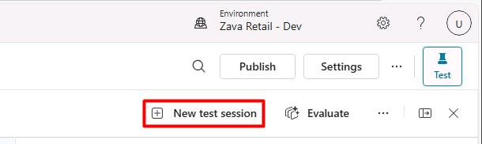
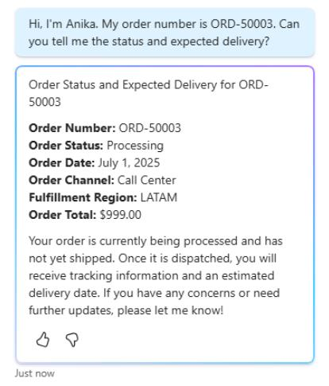
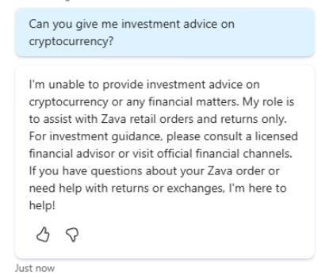

## Task 04: Test the end-to-end experience

1. In Edge, go back to your Copilot Studio tab with the **Zava Order & Returns Assistant** agent opened.

1. Near the upper-right corner of the page, select **New test session**.

    

1. In the rightmost test pane, run the following test prompts:

    1. Check Order Status:
        
        ```
        Hi, I'm Anika. My order number is ORD-50003. Can you tell me the status and expected delivery?
        ```  
        
        

    1. Out-of-Scope Question:

        ```
        Can you give me investment advice on cryptocurrency?
        ```  

        

    1. The **ZavaReturnsPolicy.pdf** knowledge source may take up to an hour to ingest, so we'll return to testing this later.
