## Task 05: Generate a Power Pages self-service site for customers

### Key tasks

#### 01: Configure settings and publish the agent

1. Near the upper-right corner of the page, select **Settings**.

    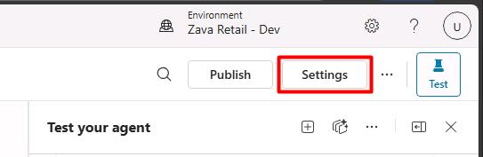

1. In the **Settings** menu, select **Security**.

1. Select **Authentication**.

    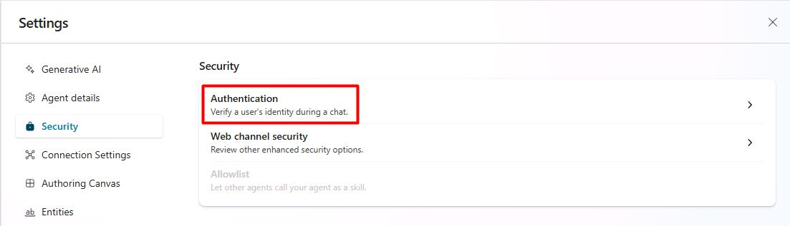

1. Select **No authentication**, then select **Save**.

    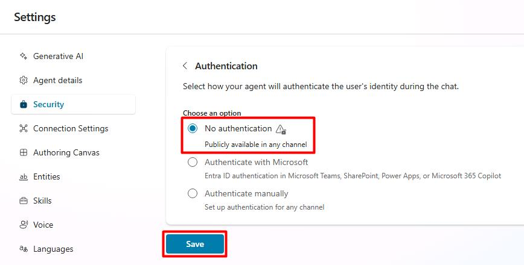

    {: .important }
    > This will allow end user interaction with the agent from the chatbot on the Power Pages site you'll be creating.

1. In the dialog, select **Save**.

1. Select the **X** near the upper-right corner of the **Settings** page to go back to the agent.

    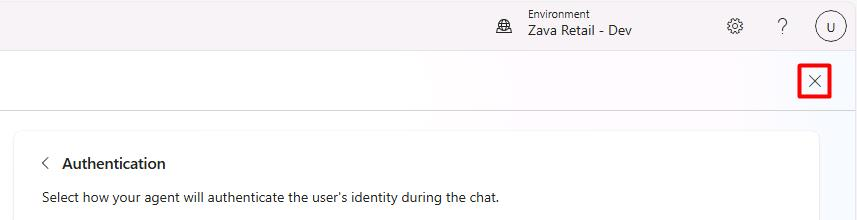

1. Near the upper-right corner of the page, select **Publish**.

    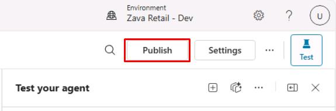

1. In the dialog, select **Publish**.

    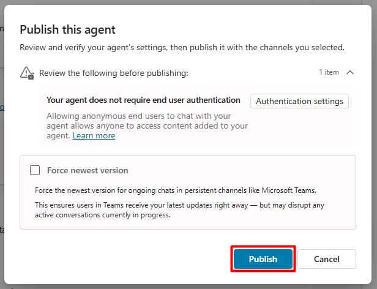

    {: .note }
    > You'll use the published agent to incorporate it into a Power Pages site. You don't need to wait for this to finish. Proceed to the next task.

---

#### 02: Create a Power Pages site

1. In a new browser tab, go to [Power Apps home page](make.powerpages.microsoft.com).

1. Near the upper-right corner of the page, verify it shows the **Zava Retail - Dev** environment.

    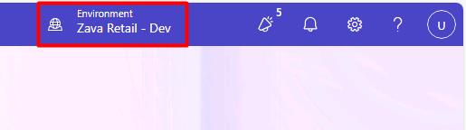

    {: .warning }
    > Depending on screen resolution, you may need to select the globe icon to open the **Select environment** pane.
    >
    > 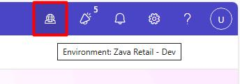

    {: .warning }
    > You may need to refresh the page for it to show the correct environment.

1. On the page, select **Get started**.

1. In the lower-right corner of the page, select **Skip**.

    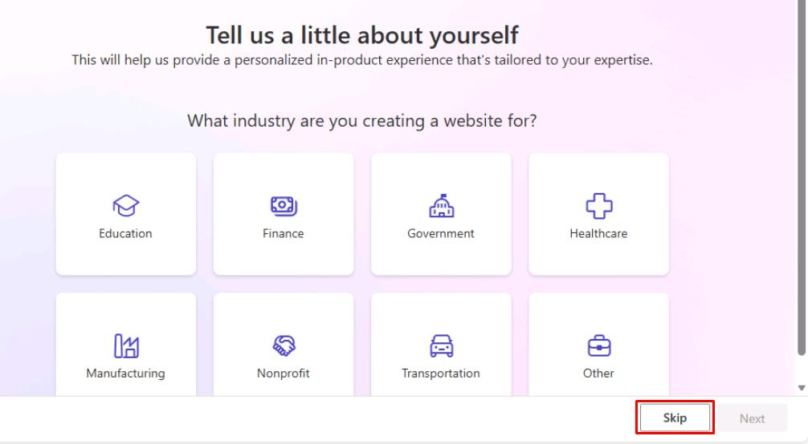

1. Move below the suggestions to the prompt box.

1. In the prompt box, enter: 

    ```
    A customer self-service site for tracking orders and returns
    ```

    

1. Select **Build my site** or **Enter**.

1. For the site details, enter the following:

    | Item | Value |
    |---|---|
    | Give your site a name  | `Zava Customer Portal` |
    | Create a web address | `z-lab-@lab.LabInstance.Id` |

    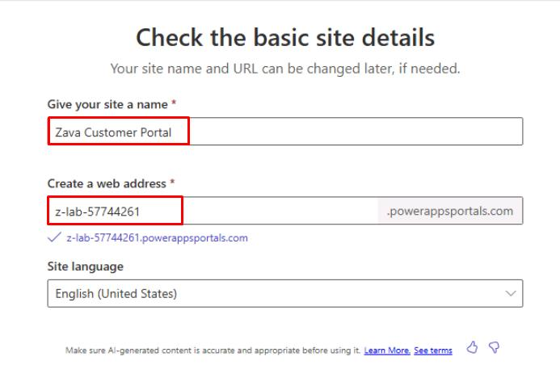

    {: .warning }
    > If you're redirected to the home page with an error saying **There are too many requests...**, expand for alternative steps.
    >
    >- Wait a minute, then try entering the previous prompt again.
    >
    >   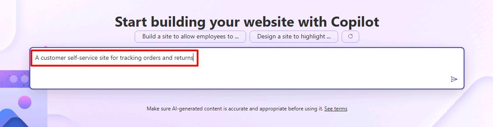
    >
    >   If you still receive an error, proceed with the following steps:
    >
    >   1. Select the **Start from blank** tile.
    >
    >   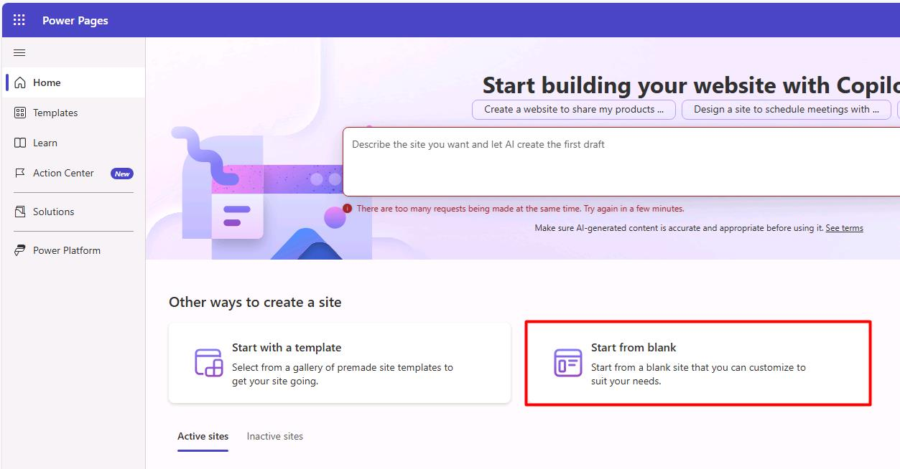
    >
    >   If you receive an error stating **This exceeds the limit of 3 development sites...**, close the wizard then try again, as this is a transient error.
    >
    >   1. For the site details, enter the following:
    >
    >       | Item | Value |
    >       |---|---|
    >       | Give your site a name  | `Zava Customer Portal` |
    >       | Create a web address | `z-lab-@lab.LabInstance.Id` |
    >
    >   1. In the lower-right corner of the page, select **Done**.
    >
    >      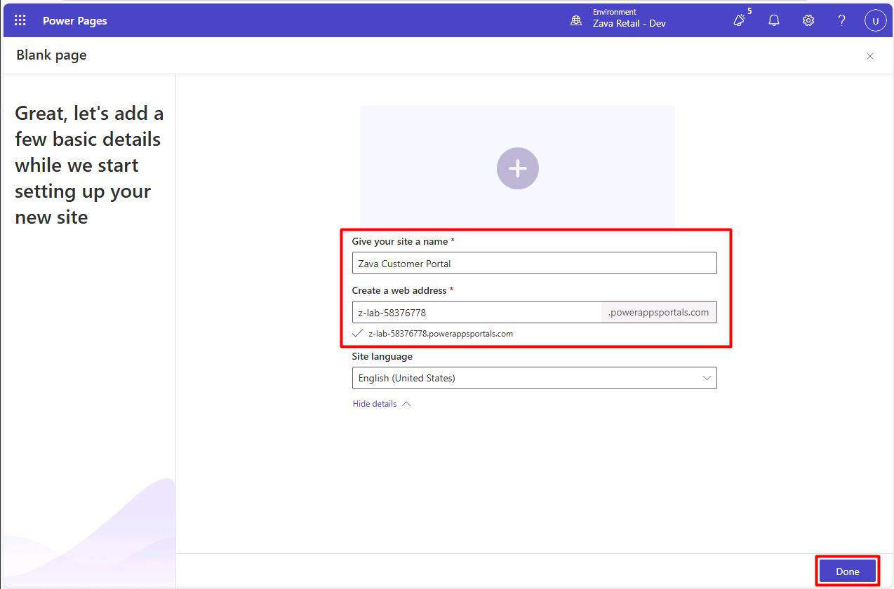
    >
    >      This will create a blank site and take you to the Power Pages design studio.
    >
    >   1. Observe the rest of the steps, then proceed to the next task.

1. In the lower-right corner of the page, select **Next**.

1. Observe the site it generates. 

    {: .note }
    > You can also move to the bottom of the page and select **Try again** for it to generate a new one.
    >
    > 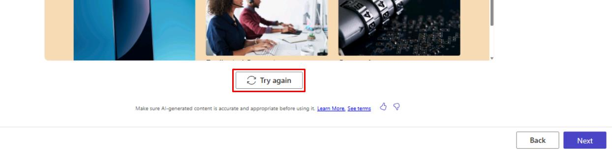

1. In the lower-right corner of the page, select **Next**.

1. Observe the options it provides for quickly generating other pages.

    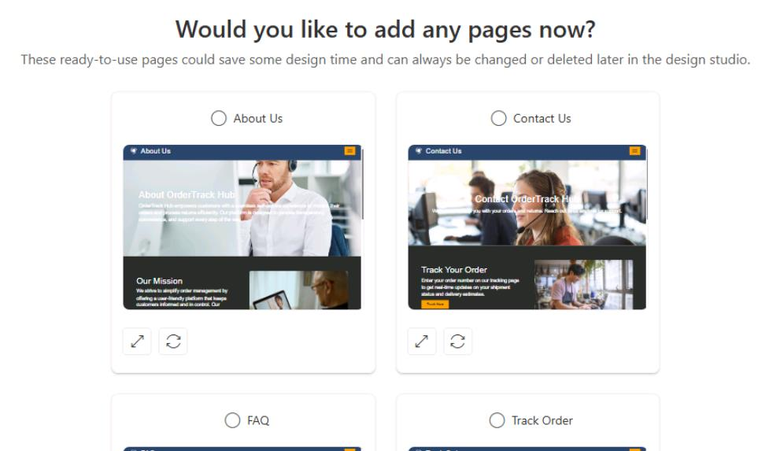

1. In the lower-right corner of the page, select **Done**.

    {: .note }
    > This will create the site and take you to the Power Pages design studio.

    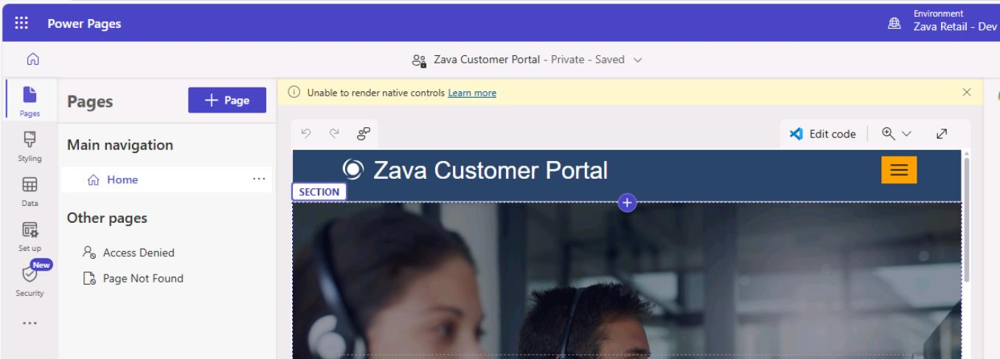

1. Observe the design studio.

---

#### 03: Add the Zava Order & Returns Assistant agent to the Power Pages site

{: .important }
> 
> [Documentation for adding an existing agent](https://learn.microsoft.com/en-us/power-pages/getting-started/agent-how-to?tabs=enhanced) states it's prelease documentation and is subject to change.

1. In the leftmost pane, select **Set up**.

1. In the **Set up** menu, under the **Copilot** section, select **Add agent**.

    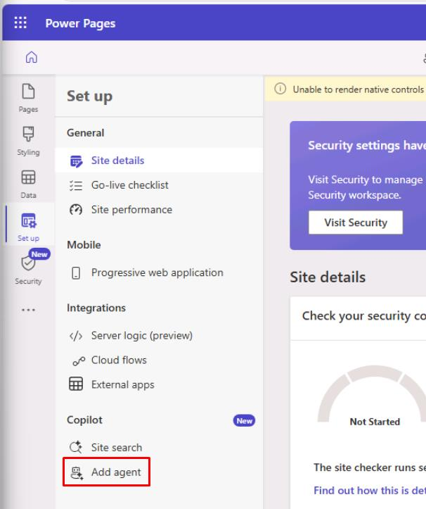

    {: .warning }
    > If you see a **Your site URL is not public...** error, refresh the page, then select **Reload** in the dialog.
    >
    > 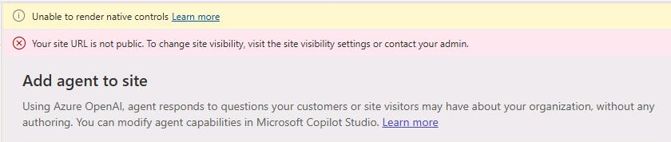

1. Select **Create agent**.

    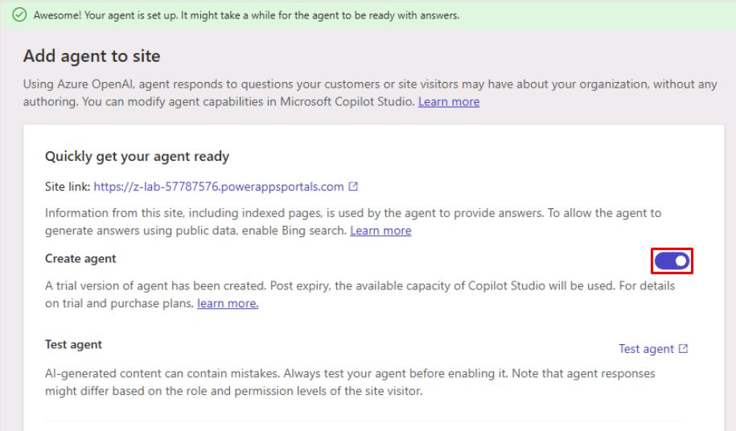

    {: .warning }
    > This may take a few minutes to create.

    {: .warning }
    > If you see the following error, refresh the page, select **Reload** in the dialog, then try again:
    >
    > 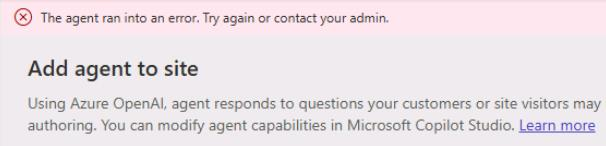

    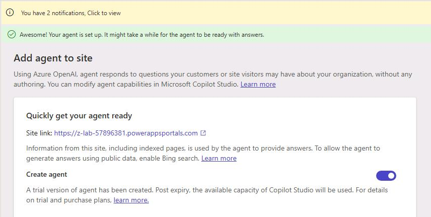

1. Once created, select **Enable agent on site**.

    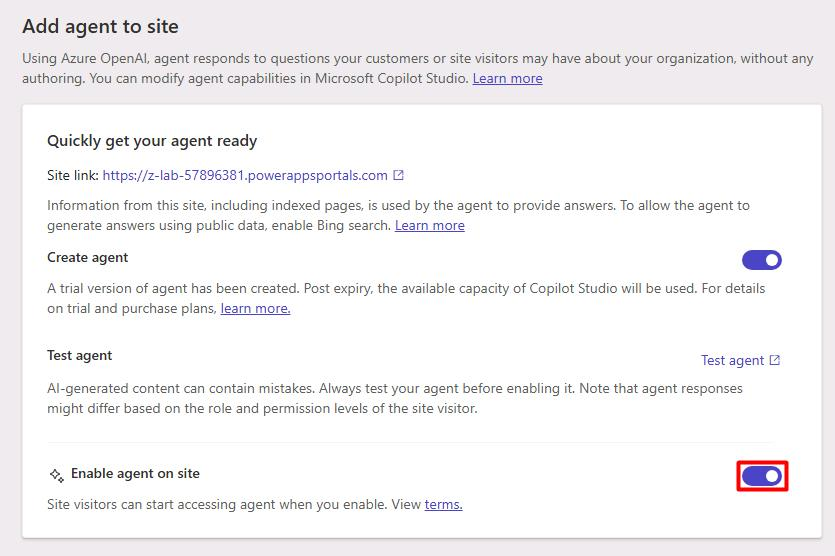

1. Once enabled, in the leftmost pane, select **Data**.

1. In the **Data** pane, search for and select the `Site Component` table.

    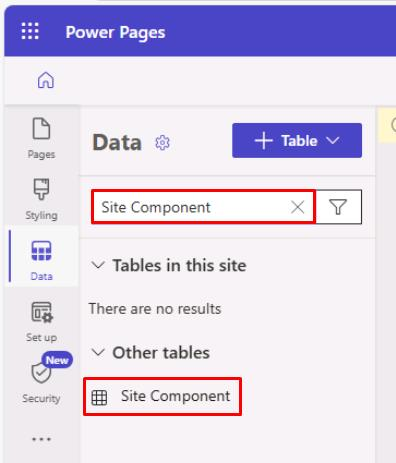

1. Move through the table and select the checkbox for **Bot Consumer**.

1. On the top bar, select **Edit row using form**.

    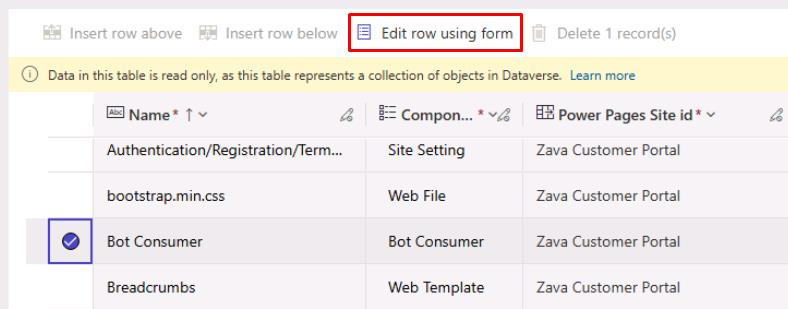

    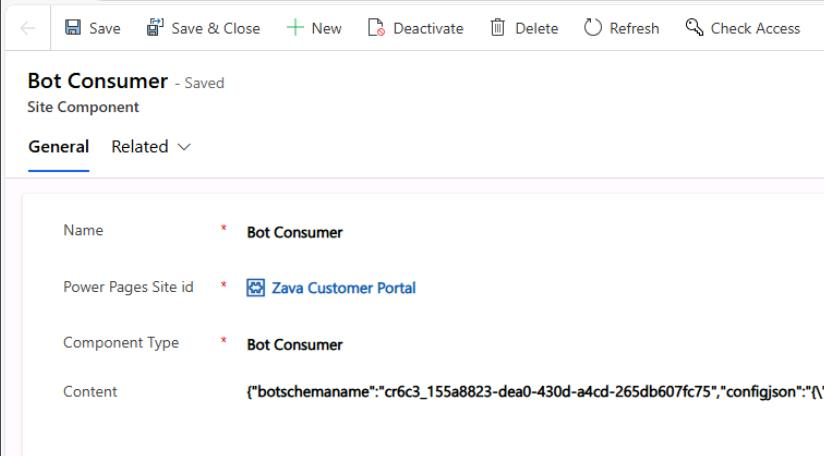

    {: .note }
    > You'll need to retrieve the schema name of the agent we configured earlier to modify this component. This will replace the default agent created in Power Pages.

1. Go back to your tab for Copilot Studio with the **Zava Order & Returns Assistant** agent page open.

1. Near the upper-right corner of the page, select **Settings**.

    

1. In the **Settings** menu, select **Advanced**.

1. Select **Metadata**.

    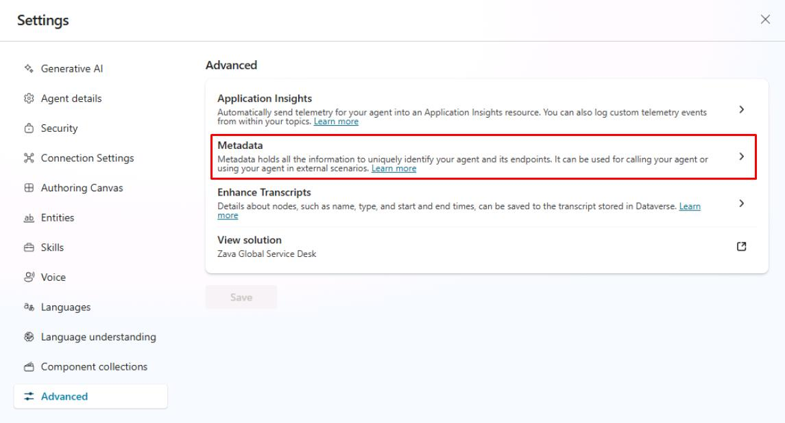

1. Copy the value of **Schema name**.

    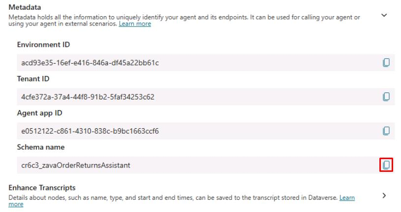

1. Go back to the **Site Component** tab.

1. In the **Content** box, replace the current value of **botschemaname** by pasting the copied schema name.

    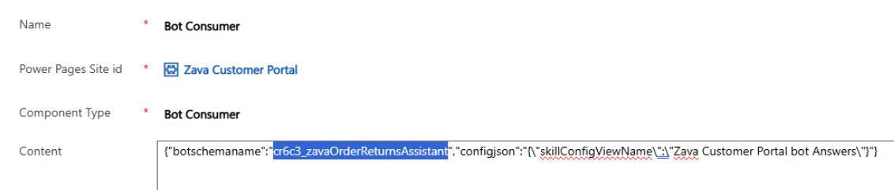

    {: .warning }
    > Keep quotes ("") intact.

1. On the top bar, select **Save & Close**.

    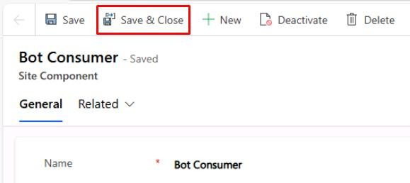

1. Back in Power Pages, select **Done** in the dialog.

---

#### 04: Preview the site

1. In the upper-right corner of the page, select **Preview** > **Desktop**.

    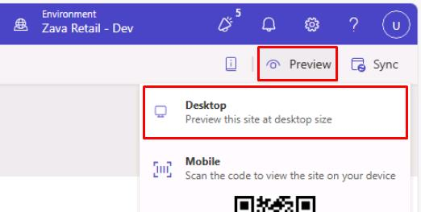

    {: .note }
    > This will open a new tab with the generated site.

1. In the permissions dialog, select **Accept**.

1. In the lower-right corner of the page, select the agent icon.

    

1. Select the chat box, which will load your **Zava Order & Returns Assistant** agent.

1. You can test similar prompts to what we tried previously to pull information for end users:

    ```
    Hi, I'm Anika. My order number is ORD-50003. Can you tell me the status and expected delivery?
    ```

    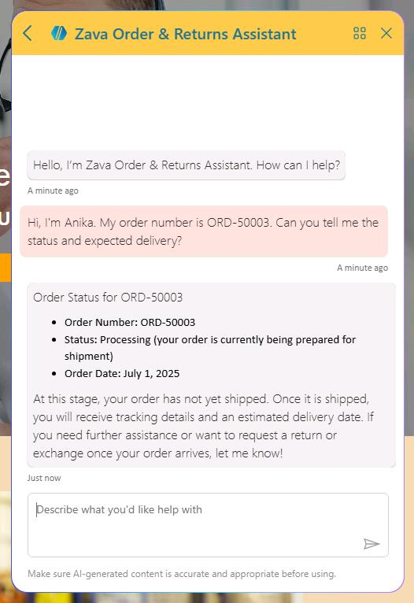

1. Close the tabs for the preview site and Power Pages.

1. In the Power Pages dialog, select **Leave**.

    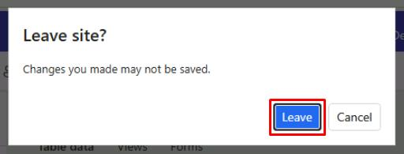