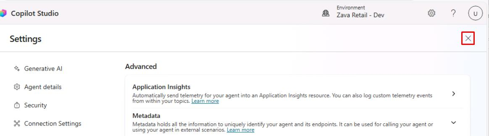
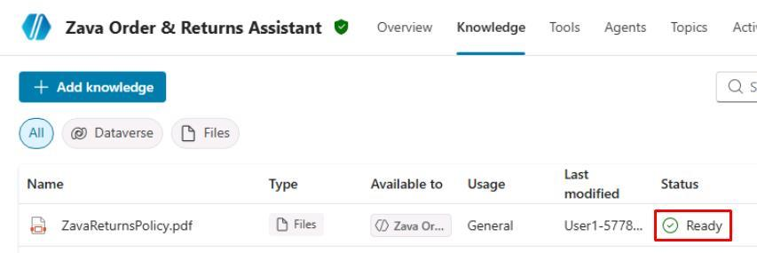
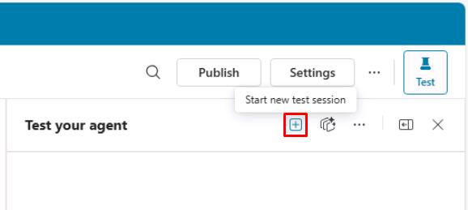
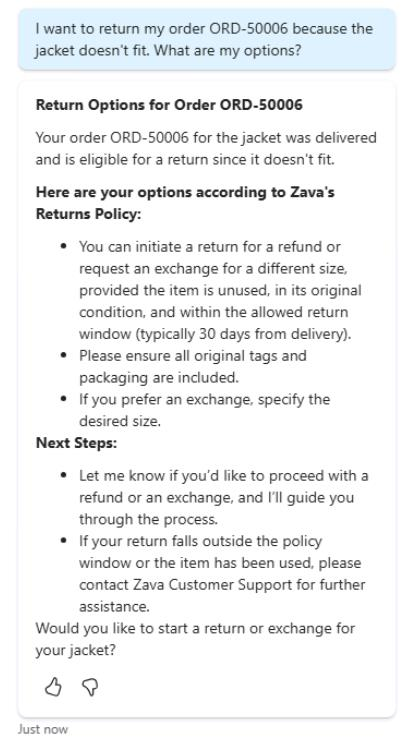

## Task 06: Test the return policy knowledge source

1. If the **Settings** page is still open in Copilot Studio, select the **X** near the upper-right corner of the page to go back to the agent.

    

1. On the top bar, select the **Knowledge** tab.

1. Check to see if **ZavaReturnsPolicy.pdf** shows **Ready**.

    

    {: .warning }
    > If time is limited and this is not yet ready, observe the following steps and proceed to the next task. This may take an additional 10-15 minutes. 

1. At the top of the rightmost test pane, select the **+** icon to start a new chat.

    

1. Test the return policy knowledge source:

    ```
    I want to return my order ORD-50006 because the jacket doesn't fit. What are my options?
    ```

    