## Task 01: Configure solution-aware pipelines


### Key tasks

#### 01: Configure Power Platform environments (OPTIONAL)

{: .warning }
> In this task, you'll run a script to recreate the Power Platform environments and import the solution. These steps are a repeat of everything accomplished in Day 1's first exercises for setting up their environment, since the live lab was split up. **YOU DO NOT NEED TO PERFORM THIS** if you are following the steps on your own in one go.

1. Sign in to the virtual machine with the following credentials (* ONLY if performing the steps in the live environment):

	| Item     | Value                                                |
	|:---------|:---------|
	| Username | **@lab.VirtualMachine(Win11-Pro-Base).Username**       |
	| Password | **+++@lab.VirtualMachine(Win11-Pro-Base).Password+++** |

1. On the VM's taskbar, open Windows PowerShell ISE.

1. In PowerShell ISE, select **File** > **New**.

1. In the top pane, enter the following:

    {: .important }
    > Select **Copy** in the following block, then paste with **Ctrl+V**.

    ```
    # --- Configuration ---
    # We use the @lab variable exactly as requested for the file path
    $labInstanceId = "@lab.LabInstance.Id"

    # Construct the full path. (Assuming .zip based on standard lab procedures)
    $solutionPath  = "C:\LabFiles\ZavaGlobalServiceDesk_" + $labInstanceId + "_1_0_0_0.zip"

    # Environment Metadata
    $envs = @(
        @{ Name = "Zava Retail - Dev";  Type = "Developer" },
        @{ Name = "Zava Retail - UAT";  Type = "Developer" },
        @{ Name = "Zava Retail - Prod"; Type = "Developer" }
    )

    $location = "unitedstates"
    $currency = "USD"
    $language = 1033

    # --- Step 1: Admin Authentication (Interactive) ---
    # This handles the environment creation and governance settings
    Write-Host "Please sign in to the Power Platform Admin account..." -ForegroundColor Cyan
    Add-PowerAppsAccount -Endpoint prod

    # --- Step 2: Create Environments & Apply Governance ---
    # We store the created IDs to use them later
    $createdEnvIds = @{}

    # Define the Governance Config (Managed Environment)
    $GovernanceConfiguration = [pscustomobject]@{
        protectionLevel = "Standard"
        settings = [pscustomobject]@{
            extendedSettings = @{}
        }
    }

    foreach ($envDef in $envs) {
        Write-Host "--------------------------------------------------"
        Write-Host "Processing: $($envDef.Name)" -ForegroundColor Cyan

        # A. Create Environment
        Write-Host "Creating environment ($($envDef.Type))..."
        $newEnv = New-AdminPowerAppEnvironment `
            -DisplayName $envDef.Name `
            -LocationName $location `
            -EnvironmentSku $envDef.Type `
            -ProvisionDatabase `
            -CurrencyName $currency `
            -LanguageName $language `
            -WaitUntilFinished $true

        $envId = $newEnv.EnvironmentName
        $createdEnvIds[$envDef.Name] = $envId
        Write-Host "Created Environment ID: $envId" -ForegroundColor Green

        # B. Set as Managed Environment
        # We use a small retry loop because the environment needs a moment to be 'ready' for governance settings
        Write-Host "Enabling Managed Environment settings..."
        $retry = 0
        $success = $false
        
        do {
            try {
                Set-AdminPowerAppEnvironmentGovernanceConfiguration `
                    -EnvironmentName $envId `
                    -UpdatedGovernanceConfiguration $GovernanceConfiguration `
                    -ErrorAction Stop
                
                Write-Host "Managed Environment enabled." -ForegroundColor Green
                $success = $true
            }
            catch {
                $retry++
                if ($retry -lt 5) {
                    Write-Host "Waiting for provisioning to settle (Attempt $retry/5)..." -ForegroundColor Yellow
                    Start-Sleep -s 15
                } else {
                    Write-Error "Failed to set Managed Environment after 5 attempts."
                }
            }
        } while (-not $success -and $retry -lt 5)
    }

    # --- Step 3: Import Solution into DEV Only (Interactive) ---
    $devName = "Zava Retail - Dev"
    $devEnvId = $createdEnvIds[$devName]

    if ($devEnvId) {
        Write-Host "--------------------------------------------------"
        Write-Host "Preparing Solution Import for: $devName ($devEnvId)" -ForegroundColor Cyan

        # A. Get and Clean URL
        $targetEnv = Get-AdminPowerAppEnvironment -EnvironmentName $devEnvId
        
        # Logic to find the correct URL property
        if ($targetEnv.EnvironmentUrl) { $rawUrl = $targetEnv.EnvironmentUrl } 
        elseif ($targetEnv.InstanceApiUrl) { $rawUrl = $targetEnv.InstanceApiUrl } 
        else { $rawUrl = $targetEnv.Internal.properties.linkedEnvironmentMetadata.instanceApiUrl }

        # Clean the URL (.api.crm -> .crm)
        $cleanUrl = $rawUrl -replace "\.api\.crm", ".crm"
        Write-Host "Target URL: $cleanUrl" -ForegroundColor Cyan

        # B. Connect to Dataverse (Interactive)
        # We use AuthType=Office365 for interactive user login
        Write-Host "Connecting to Dataverse..."
        $connStr = "AuthType=Office365;Url=$cleanUrl;RequireNewInstance=True"
        
        try {
            $conn = Get-CrmConnection -ConnectionString $connStr -ErrorAction Stop
        }
        catch {
            Write-Error "Connection Failed: $_"
            break
        }

        # C. Import & Publish
        if ($conn.IsReady) {
            Write-Host "Connected. Importing: $solutionPath"
            
            try {
                # Import
                $importJob = Import-CrmSolution `
                    -conn $conn `
                    -SolutionFilePath $solutionPath `
                    -OverwriteUnmanagedCustomizations $true `
                    -Verbose
                
                Write-Host "SUCCESS: Solution imported." -ForegroundColor Green
                
                # Publish
                Write-Host "Publishing customizations..."
                Publish-CrmAllCustomization -conn $conn -Verbose
                Write-Host "SUCCESS: All customizations published." -ForegroundColor Green
            }
            catch {
                Write-Error "IMPORT FAILED: $_"
            }
        }
    }
    else {
        Write-Error "Could not find the Dev environment ID. Skipping import."
    }
    ```

1. On the top bar, select **Run Script** ().

    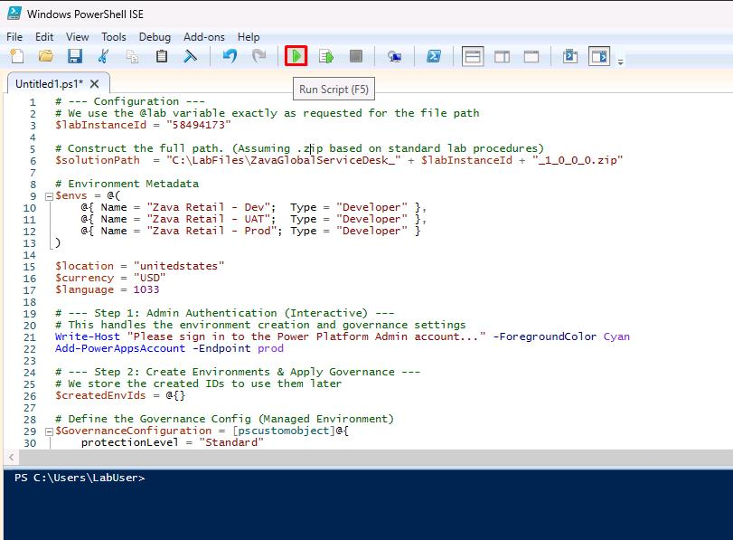

1. In the dialog, sign in with your lab credentials.

1. Wait until the script completes in the bottom pane.

    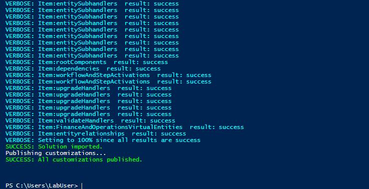

    {: .warning }
    > This will take a few minutes.

1. Close the PowerShell ISE window without saving.

---

#### 02: Setup pipelines

1. Open Edge, then go to [Power Apps home page](make.powerapps.com).

1. Sign in with your lab credentials.

1. In the dialog, select **Get started**.

1. Near the upper-right corner of the page, select **Environment**, then select **Zava Retail - Dev**.

    

    

    {: .warning }
    > Depending on screen resolution, you may need to select the globe icon to open the **Select environment** pane.
    >
    > 

1. In the leftmost pane, select **Solutions**.

1. Select **Zava Global Service Desk**.

    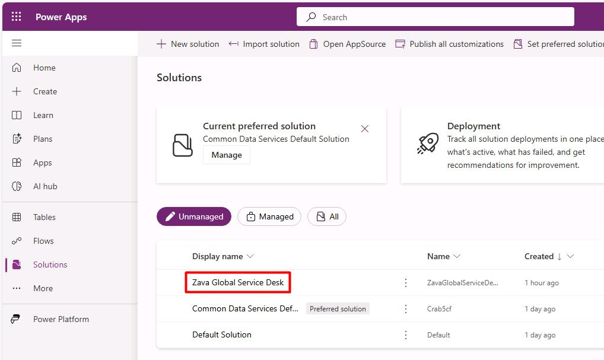

1. In the leftmost pane, select the **Pipelines** () icon.

    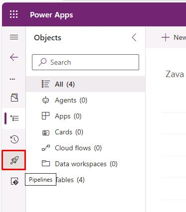

1. On the top bar, select **Create pipeline**.  

    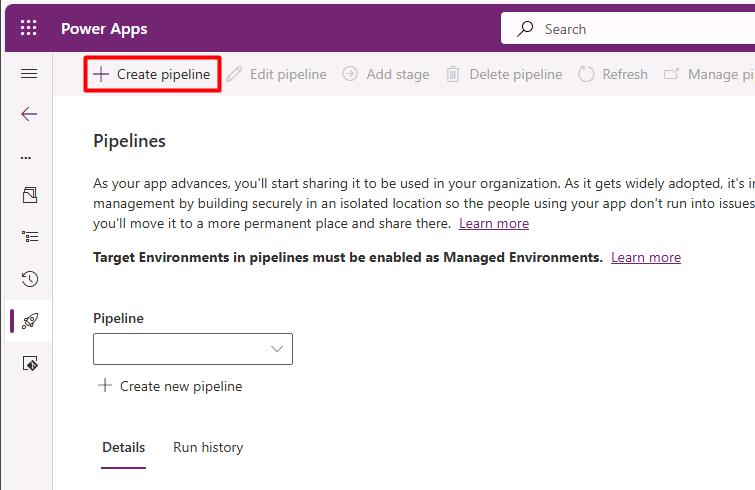

1. In the flyout pane:

    1. Enter the following values:

        | Item | Value |
        |---|---|
        | Name | `Zava Retail - ALM Pipeline` |
        | Target environment | **Zava Retail - UAT** |

        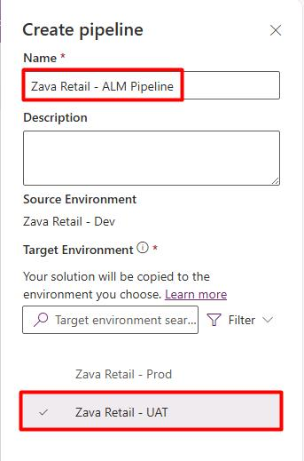

    1. At the bottom of the pane, select **Save**.

1. On the top bar, select **Add stage**.

    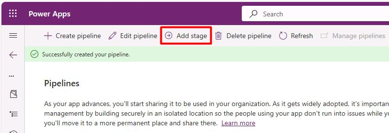

1. In the flyout pane:

    1. Enter the following values:

        | Item | Value |
        |---|---|
        | Name | `Zava Retail - Prod` |
        | Target environment | **Zava Retail - Prod** |

        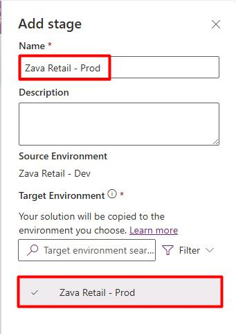

    1. At the bottom of the pane, select **Save**.

    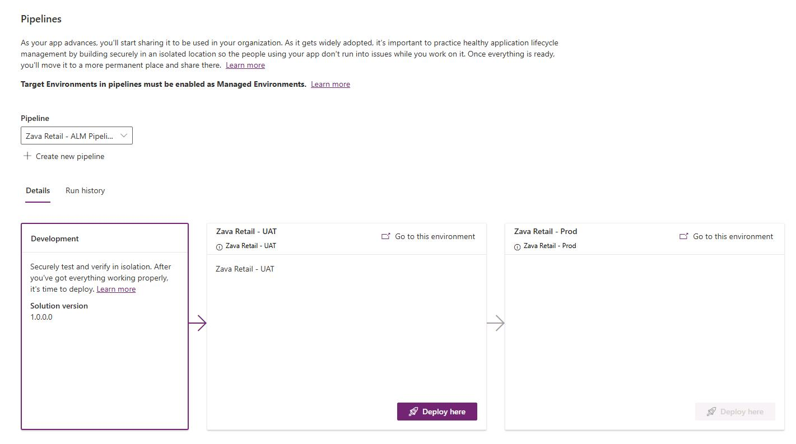

---

#### 03: Deploy using platform host pipelines

1. On the **Zava Retail – UAT** stage, select **Deploy here** to initiate the solution deployment to UAT.  

    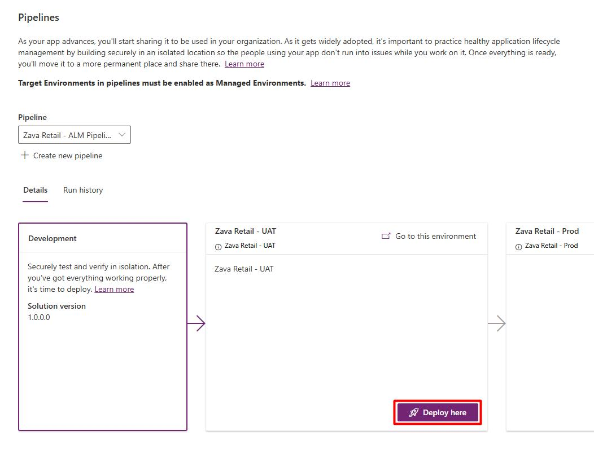

1. In the flyout pane:

    {: .warning }
    > If it appears, you can ignore the **EnvironmentNotFound** error.

    1. Under **Deployment schedule**, keep the default of **Now**.

        {: .important }
        > Selecting **Later** will allow you to set a time and date for the scheduled deployment.

    1. At the bottom of the pane, select **Next**.

        {: .warning }
        > Validation may take a couple minutes.

    1. On the **Summary** step, observe the AI-generated **Deployment notes**, which contains a summary of the solution's capabilities.
    
    1. At the bottom of the pane, select **Deploy**.

        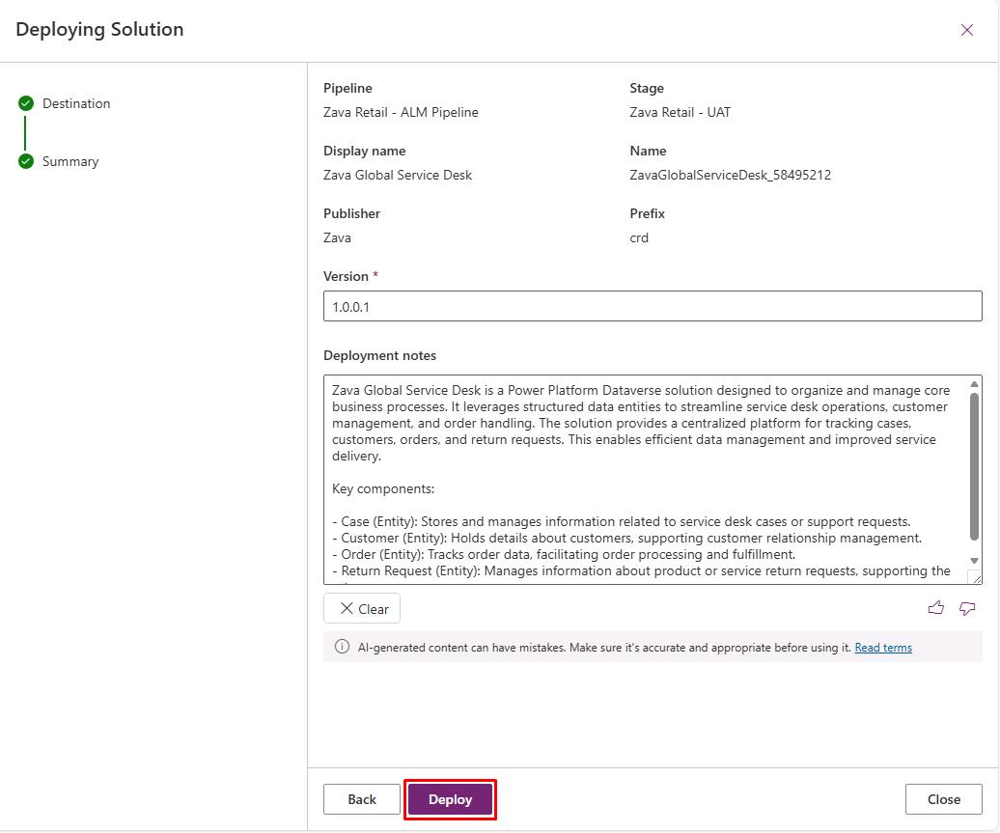

1. Wait until deployment completes.

    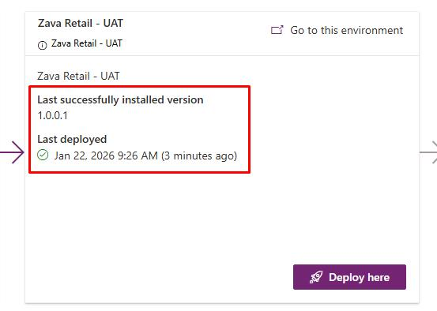

    {: .warning }
    > This may take 5-10 minutes.

1. On the **Zava Retail - Prod** stage, select **Deploy here**.

    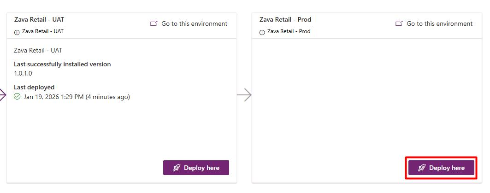

1. In the flyout pane:

    1. At the bottom of the pane, select **Next**.

    1. Select **Deploy**.

    {: .note }
    > Proceed to the next task. You don't need to wait for this to complete.

---

{: .important }
> [Platform host pipelines](https://learn.microsoft.com/en-us/power-platform/alm/platform-host-pipelines) are not shareable, nor can they be extended to support approvals or delegations. You can look into [custom host pipelines](https://learn.microsoft.com/en-us/power-platform/alm/custom-host-pipelines) for these options.
