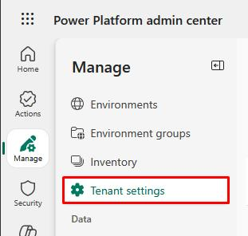
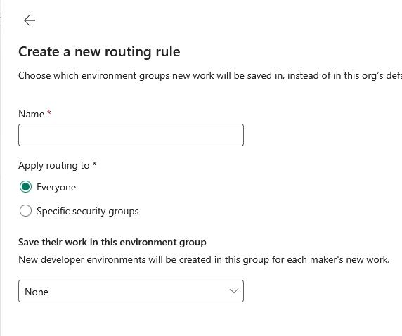

## Task 02: Use environment routing for both apps and Copilot Studio agents  
 
{: .warning }
> All of the following tasks require tenant-level admin permissions, which the platform cannot provide. You may either:
>
> - Observe the following steps, or
> - Follow along from a personal tenant
>
> You can later use the GitHub-hosted instructions to run through the steps on your own, as well.

1. Go back to your Power Platform tab, or go to the [Power Platform admin center](admin.powerplatform.microsoft.com).

1. In the leftmost pane, go to **Manage**.

1. In the **Manage** menu, select **Tenant settings**.  

    

1. Select **Environment routing: Personal development**.  

1. In the flyout pane, turn on environment routing for **Power Apps** and **Copilot Studio**.  

    

1. Select **Save and create rules**.

1. You can name it, apply routing to all users or specific security groups, and set the environment to save a maker's new work to.

    