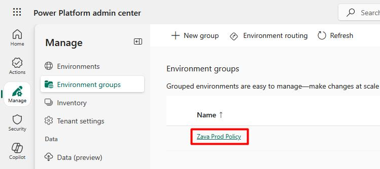
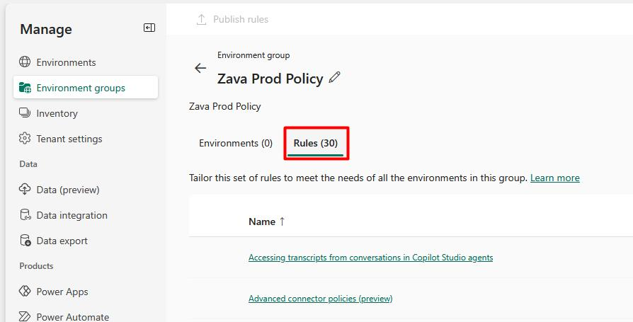
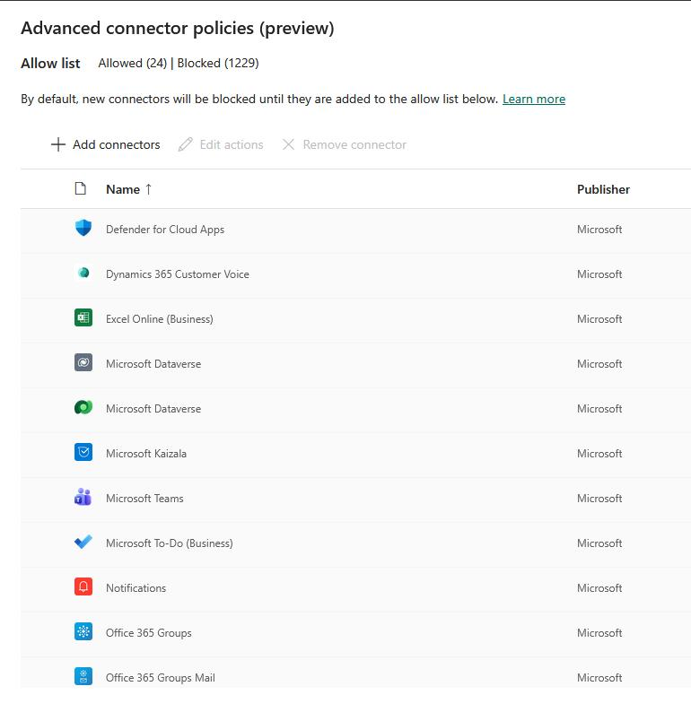
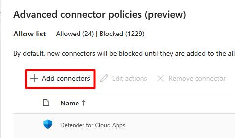
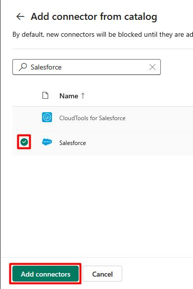
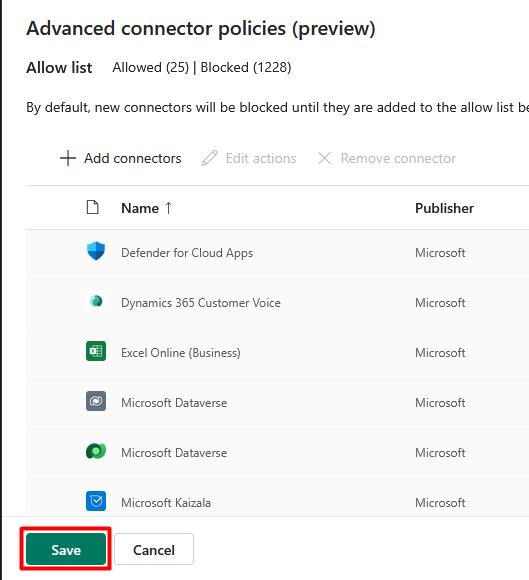
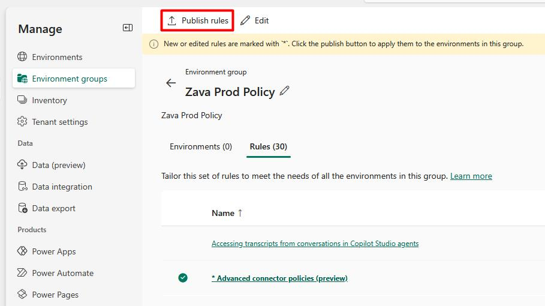

## Task 03: Create advanced connector policies for Zava's retail environments

{: .warning }
> Requires tenant-level admin permissions.

{: .important }
> The new advanced connector policies are replacing the old DLP policies in the Power Platform admin center.

1. In the leftmost pane, select **Manage**.

1. In the **Manage** menu, select **Environment groups**.

1. After creating an environment group and adding the environment you want to govern, select the group.

    

1. Select the **Rules** tab.

    

1. Select **Advanced connector policies (preview)**.

1. In the flyout pane, you'll see several connectors added to the **Allow list** by default. All other connectors are blocked by default.

    

1. At the top of the table, select **Add connectors**.

    

1. You can search for a connector you need to allow in the environment, then select **Add connectors** at the bottom of the pane.

    

1. After making any changes, select **Save** at the bottom of the pane.

    

1. Once saved, on the top bar, select **Publish rules** to apply the new policy to the environment group.

    