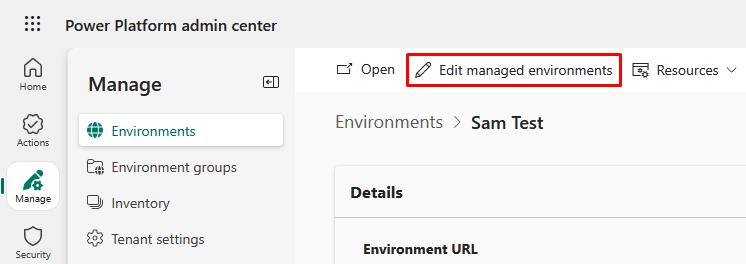
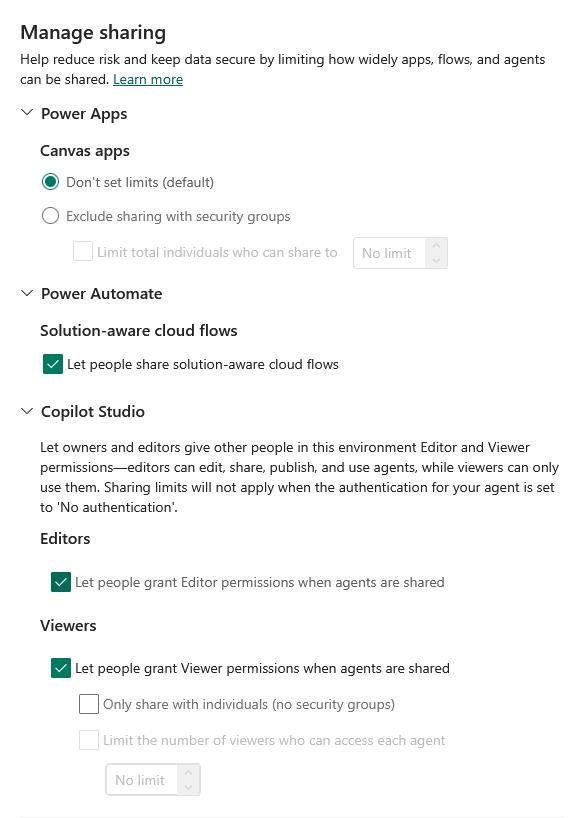
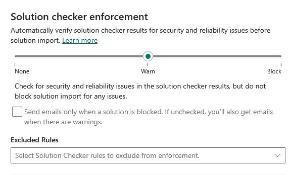
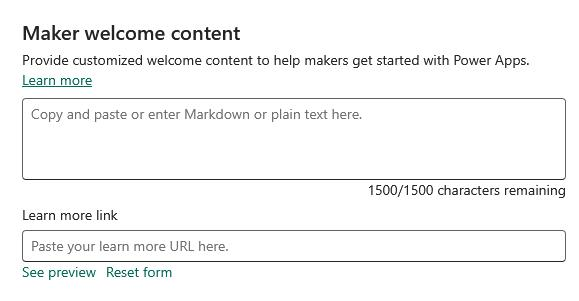

## Task 04: Configure managed environment maker rules and sharing limits  

{: .warning }
> Requires tenant-level admin permissions.

1. For each environment, in the Power Platform admin center go to **Environments**, then select the environment.  

1. On the top bar, select **Edit managed environments**.

    

1. In the flyout pane:

    1. Under **Manage sharing**, you can configure sharing limits for various products.

        - Power Apps
        - Power Automate
        - Copilot Studio

        

    1. Below that, you can configure **Solution checker enforcement** for automatic verification of security and reliability issues before imports.

        

    1. You can also configure **Maker welcome content** to help your makers get started. 

        