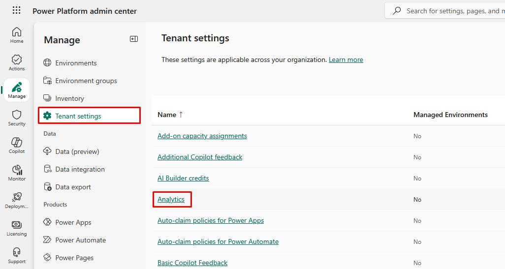
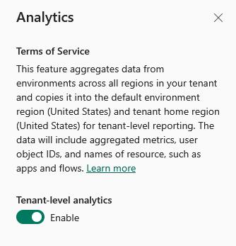

## Task 05: Turn on Platform Analytics & CoE Monitoring  

{: .warning }
> Requires tenant-level admin permissions.

1. In the **Manage** menu, go to **Tenant settings**.

1. Select **Analytics**.

    

1. In the flyout pane, enable **Tenant-level analytics**.

    

{: .important }
> At this point, you could also deploy the Power Platform Center of Excellence (CoE) Starter Kit in a separate admin environment to track apps, flows, agents, and environments, to monitor for DLP policy violations and unused assets.  

---

# Congratulations!
You've successfully completed the lab. Select **End** to mark the lab as **Complete**.